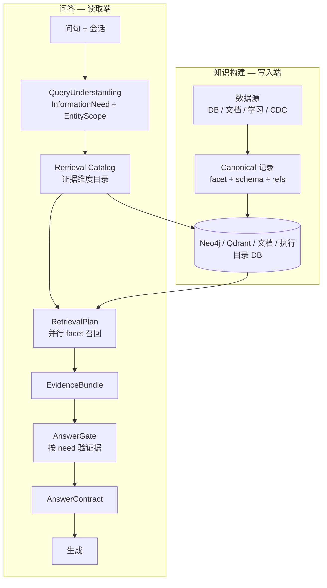

# 企业知识库通用化重构方案

> 版本：2026-05-29  
> 状态：方案 / 待评审  
> 前提：**作为通用服务，不允许与实际业务场景强耦合的代码逻辑**  
> 关联：[意图识别评估](./intent-routing-assessment-and-plan.md)、[知识沉淀指南](./knowledge-sedimentation-guide.md)、[EKSP](./enterprise-knowledge-sync-platform.md)、[建设缺口](./enterprise-knowledge-building-gaps.md)、[已知问答问题](./enterprise-qa-known-issues.md)

本文档汇总意图识别、检索编排、知识构建三方面的讨论结论，给出**可配置、可扩展、业务无关**的统一调整方案。业务语义（表名、枚举、关键词、输出格式）一律外置；Java 只实现通用模式（匹配、并行召回、闸门、会话状态机）。

---

## 1. 背景与问题陈述

### 1.1 已验证能力

- **CDC**：业务库变更可反映到问答（数据新鲜度通路成立）。
- **多路检索骨架**：图谱、向量、MySQL、文档、主动学习已并存。
- **配置外置趋势**：`business-rules.json`、`enterprise-lexicon.json`、证据 schema、输出契约等已部分配置化。

### 1.2 核心矛盾

当前系统将 **`queryType`（业务题型枚举）** 同时用于：

| 职责 | 问题 |
|------|------|
| 选择检索管道 | 判错则整条链路错误（如任职 vs 证照） |
| 闸门证据校验 | 证据维度与题型不匹配仍可能放行或误拒 |
| 输出契约 | 生成格式与检索耦合 |
| 结构化 SQL 场景 | 每增场景改 Java 分支 |

导致：

1. **召回面狭隘**：一种问法映射一条管道，无法覆盖「目录型 / 实例型 / 叙述型」并存。
2. **构建与检索错位**：知识已写入（如类型字典、compiled 文档），但构建形态无 `facet` 元数据，检索认不出。
3. **多轮脆弱**：会话状态未结构化，追问依赖 LLM 读自然语言答案。
4. **配置双轨**：lexicon、business-rules、学习沉淀、执行目录未分层，演进靠发版。

### 1.3 重构原则（硬性约束）

| # | 原则 | 含义 |
|---|------|------|
| P1 | **代码只做模式，不做语义** | Java 不出现具体表名、证照种类、职位名称、公司后缀等业务词 |
| P2 | **配置分三层** | 执行目录 / 语义目录 / 事实知识 分离存放与变更流程 |
| P3 | **宽召回、窄生成** | 检索并行多证据维度，由需求与闸门筛选；不在路由阶段砍路 |
| P4 | **构建与检索共用词汇表** | `facet`、`granularity`、`evidenceSchema` 在写入与读出两侧一致 |
| P5 | **LLM 辅助理解，规则辅助兜底** | 意图层输出结构化「需求 + 实体」，不输出互斥业务题型 |
| P6 | **可观测、可回归** | trace 暴露 need / facets / rejectReason；黄金用例进 `data/eval/` |

---

## 2. 目标架构总览



**读写分离、语义对齐**：构建产出带元数据的 Canonical 记录；检索按 Catalog 选维度，不按 `queryType` 选管道。

---

## 3. 领域模型（替代 queryType 中心制）

### 3.1 QueryUnderstanding（意图层输出）

```json
{
  "need": {
    "subjectKind": "person | organization | catalog | policy | document | mixed",
    "facet": "role | certificate | profile | relation | compliance | aggregate | definition | semantic",
    "granularity": "instance | type_catalog | list | single_fact | comparison | narrative",
    "listExpected": true,
    "confidence": 0.85
  },
  "scope": {
    "person": { "displayName": "", "anchorId": null },
    "organizations": [{ "name": "", "anchorId": null, "status": "" }],
    "filters": {},
    "sessionRefs": []
  },
  "reason": "简短说明",
  "legacyQueryType": ""
}
```

- **`need`**：用户要什么**形态**的信息（通用维度，可扩展枚举）。
- **`scope`**：查谁、查哪些主体、会话继承的实体集（结构化，非 LLM 长文本）。
- **`legacyQueryType`**：过渡期仅作 trace / 兼容映射，**不参与**检索分支。

### 3.2 Retrieval Catalog（执行目录，配置/DB）

描述「知识库有哪些证据维度、如何取数」，**不含业务话术**：

```json
{
  "dimensionId": "certificate_instance",
  "sources": ["mysql", "graph", "vector"],
  "evidenceSchema": "person_certificate_v1",
  "anchorPolicy": "person_or_organization",
  "match": {
    "needFacet": ["certificate"],
    "needGranularity": ["instance", "list"]
  },
  "retrieverRef": "structuredQuery:person_stewardship"
}
```

```json
{
  "dimensionId": "certificate_type_catalog",
  "sources": ["document", "vector", "enum"],
  "evidenceSchema": "catalog_v1",
  "anchorPolicy": "none",
  "match": {
    "needFacet": ["certificate"],
    "needGranularity": ["type_catalog", "definition"]
  },
  "retrieverRef": "catalog:certificate_types"
}
```

Java 通用逻辑：`match(need, scope) → 选出 N 个 dimension → 并行 retriever → 合并`。

### 3.3 RetrievalPlan（检索计划）

```json
{
  "dimensions": [
    { "id": "certificate_type_catalog", "weight": 0.9, "required": false },
    { "id": "certificate_instance", "weight": 1.0, "required": true }
  ],
  "mergeStrategy": "union_rerank | list_complete | catalog_first",
  "topK": 64,
  "secondPassPolicy": "on_gate_mismatch"
}
```

由 **Catalog + need + scope** 推导；**禁止** `if (queryType == xxx)` 式 Java 分支。

### 3.4 AnswerContract（作答契约，与检索解耦）

| 契约 | 触发条件（通用） | 行为 |
|------|------------------|------|
| `list_complete` | `listExpected=true` | 条数与证据一致 |
| `type_catalog` | `granularity=type_catalog` | 只列类型名，可去重 |
| `structured_row` | 证据为键值行 | 按 schema 字段列示 |
| `narrative` | `granularity=narrative` | 叙述型 |

契约从配置读取，按 `need` 选择，**不绑定**单一 queryType。

### 3.5 AnswerGate（闸门，按需求验证据）

| need.granularity | 闸门（通用） |
|------------------|--------------|
| `type_catalog` | 存在任一 `catalog_v1`（或配置的 catalog schema）证据 |
| `instance` + facet | 存在对应 `evidenceSchema` 的实例证据 |
| `list` | 证据条数 ≥ 配置阈值，或触发二跳 |
| 无锚点且需 instance | 澄清或降级为 catalog/semantic，非直接拒答 |

---

## 4. 意图识别层调整

### 4.1 组件职责（重构后）

| 组件 | 职责 | 禁止 |
|------|------|------|
| `IntentRouterService` | 编排 LLM + 规则 + 追问；输出 `QueryUnderstanding` | 业务关键词硬编码 |
| `IntentLlmClassifier` | 输出 `need` + `scope` JSON | 枚举具体业务题型为主路径 |
| `IntentDecisionEnricher` | 补全锚点、会话合并、消歧 | 用规则覆盖 LLM 已给出的具体 facet/granularity |
| `QueryTypeRoutingPolicy` | 读配置：槽位要求、兼容映射 | 写死 `person_role_list` 等 |
| `FollowUpSessionHintMerger` | 指代词来自配置，合并 session 实体 | 业务场景 if-else |

### 4.2 LLM Prompt 方向

- 输出 **need 维度 + scope 槽位**，不强制单选 `queryType`。
- 追问 prompt：强调「当前问句语义优先，维度可切换」。
- 业务示例仅作 few-shot，**不写入 Java**。

### 4.3 规则引擎角色

- **只补空缺**：锚点缺失、占位 granularity、消歧。
- **不覆盖**：LLM 已给出具体 `facet` + `granularity` 时，规则不得换成另一具体类型。
- **推断算法通用化**：关键词命中计分、取最高，顺序由配置决定。

### 4.4 会话状态

`ConversationTurn` 增加结构化字段（通用）：

```json
{
  "entityScope": { "person": {}, "organizations": [] },
  "lastNeed": { "facet": "", "granularity": "" },
  "retrievedEntitySets": {}
}
```

- 追问从 **session scope** 解析指代，不从答案文本解析。
- `focusPersonName` 等须经 `sanitize`，禁止写入 LLM 长文本。

---

## 5. 检索层调整

### 5.1 默认策略：宽召回 + 维度重排

1. **第一跳**：Catalog 选中维度后**并行**召回（图 / 向量 / 结构化 / 文档 / 常识 / 学习）。
2. **合并**：去重、按 dimension weight + 相关性重排。
3. **列表模式**：`listExpected=true` 且锚点齐全时，少截断、专用 `list_complete` 合并策略。
4. **第二跳**：闸门 `on_gate_mismatch` 时扩展 scope 或补拉缺失 dimension。

### 5.2 淘汰项（逐步删除）

| 现状 | 目标 |
|------|------|
| `RetrievalPlan.personRoleList()` 硬分支 | `dimensions[]` 驱动 |
| `QaRetrievalPipeline` 内 `queryType` 字符串判断 | Catalog 匹配 |
| `PersonCertificateQueryService` 等业务命名 Retriever | 通用 `StructuredQueryRetriever` + 配置表映射 |
| 闸门 `requiredEvidenceByQueryType` | `requiredEvidenceByNeed` |

### 5.3 Retriever 插件化（代码层通用接口）

```java
interface EvidenceRetriever {
    String dimensionId();
    List<ContextChunk> retrieve(RetrievalContext ctx);
}
```

- `RetrievalContext`：`question`, `need`, `scope`, `topK`。
- 具体表、Cypher、文档路径均在 **Catalog / structuredQueries 配置** 中。

---

## 6. 知识库构建层调整（与检索对齐）

### 6.1 三层知识（与 §3.2 对应）

| 层级 | 内容 | 构建来源 | 存储 |
|------|------|----------|------|
| **L1 执行目录** | 有哪些 dimension、对应 retriever | schema 沉淀、sync-manifest | DB / JSON |
| **L2 参考/catalog** | 枚举、字典、制度索引 | enum 文件、compiled catalog 段、学习 | 独立 JSONL + 向量点 + 可选图节点 |
| **L3 实例** | 行级事实、关系 | Bulk、CDC、Live SQL | 图 + 向量 + 业务库 |

### 6.2 Canonical JSONL v2（构建标准格式）

每条记录**必须**携带：

| 字段 | 说明 |
|------|------|
| `domain` | 域包 ID（可插拔） |
| `entityType` / `entityId` | 稳定主键 |
| `facet` | 与检索 Catalog 一致 |
| `granularity` | `instance` / `type_catalog` / … |
| `evidenceSchema` | 与 `evidence-schemas.json` 一致 |
| `text` | 检索用摘要 |
| `refs` | 锚点 ID（person、org、catalog key） |

**禁止**：仅按「一个实体一篇大文档」输出而无 facet 拆分。

### 6.3 向量 / 图谱写入规范

- **多点策略**：同一实体可按 facet 多个 vector point，payload 含 `facet`、`granularity`、`evidence_schema`。
- **Catalog 独立点**：`type_catalog` 类知识单独建点，不嵌在公司摘要内。
- **稳定 point id**：`domain + entity_type + entity_id + facet`（EKSP 原则）。
- **CDC upsert**：按 facet 更新/删除，避免只更新公司级摘要导致目录类证据丢失。

### 6.4 主动学习

- 入库时打标 `facet` / `granularity`（LLM 或配置规则）。
- **接入 Qdrant 主召回**（与 MySQL 关键词并存，逐步以向量为主）。
- 写入 **L2/L3 事实**，不写入 Java 检索分支。

### 6.5 与 EKSP 的关系

本方案与 [enterprise-knowledge-sync-platform.md](./enterprise-knowledge-sync-platform.md) **一致**：

- Domain Pack 产出 Canonical JSONL v2。
- 增量 upsert 替代 wipe 为主路径。
- 执行目录由 sync-manifest + schema 沉淀自动生成。

---

## 7. 配置分层（禁止混写）

| 类型 | 存放 | 变更方式 | 示例 |
|------|------|----------|------|
| **执行目录** | DB / `retrieval-catalog.json` | 版本 + 审计；schema/CDC 驱动 | dimension、retrieverRef、schema 要求 |
| **语义目录** | `qa_routing_hints` / 审核后学习集 | 运营确认 | 同义词、追问模式、指代词 |
| **事实知识** | 向量 / 图 / 文档 / 业务库 | 灌库、CDC、学习 | JSONL、制度文 |
| **输出契约** | `answer-output-contracts.json` | 按 need 映射 | list_complete、type_catalog |
| **枚举/catalog** | `*-enums.json` + L2 JSONL | 与业务枚举同步 | 类型字典 |

`business-rules.json` 与 `enterprise-lexicon.json` **收敛**：

- 执行相关 → 迁入 retrieval-catalog + structuredQueries。
- 语义相关 → 迁入语义目录。
- 过渡期保留兼容加载，不再新增业务规则。

---

## 8. 代码边界：允许 vs 禁止

### 8.1 Java 允许（通用）

- JSON/YAML 配置加载与校验。
- `need` × `scope` × catalog 的模式匹配。
- 并行召回、合并、重排、闸门、二跳。
- 会话状态机、实体 sanitize、锚点解析（配置化 blocklist/模式）。
- LLM 调用与 JSON 解析、超时降级。
- Retriever 插件接口与注册表。

### 8.2 Java 禁止（业务耦合）

- `if (queryType.equals("person_role_list"))` 等业务分支。
- 硬编码表名、列名、中文业务词（证照、法人、分公司…）。
- 在 Pipeline 内写死「某场景专用」Retriever 类名。
- 闸门写死某一业务 evidence source 字符串（改由 schema 配置）。
- Prompt 内嵌大段业务字段说明（改外置 prompt 模板 + catalog 摘要）。

### 8.3 业务差异一律外置

- 表映射 → `structuredQueries` / Domain Pack。
- 枚举标签 → enum JSON + Canonical catalog 记录。
- 关键词 → lexicon / 语义目录。
- 输出列 → evidence-schemas + answer contracts。

---

## 9. 分阶段实施计划

### 阶段 0：基线（约 1 周）

| 任务 | 产出 |
|------|------|
| 黄金用例集 | `data/eval/`：单轮/多轮/目录型/列表型/无锚点 |
| Trace 增强 | 输出 `need`、`dimensions`、`gateReason` |
| 文档 | 本文档 + 各模块 README 链接 |

### 阶段 1：Catalog 与目录型知识（约 2 周）

**检索侧**

- 新增 `retrieval-catalog.json`（或 DB 表）与 `RetrievalCatalogRegistry`。
- 实现 `certificate_type_catalog` dimension（enum + compiled catalog retriever）。
- 闸门按 `need.granularity` 分流；`type_catalog` 不再要求 instance schema。

**构建侧**

- JSONL 输出独立 catalog 记录；向量独立 catalog point。
- compiled 字典段与 JSONL catalog 同步生成。

**意图侧**

- LLM 输出增加 `granularity=type_catalog` 能力；enrich 不覆盖。

**验收**：「有哪些类型 / 种类」类问法可答，无需 person/org 锚点。

### 阶段 2：QueryUnderstanding 主路径（约 2–3 周）

- 引入 `QueryUnderstanding`，`IntentDecision` 标记 `@Deprecated` 映射。
- `RetrievalPlanFactory` 从 Catalog 生成 `dimensions[]`。
- 宽召回默认：并行所有匹配 dimension，加权重排。
- 删除或空心化主要 `queryType` 管道分支。

**验收**：任职列表、实例证照、类型目录共用 pipeline，trace 可见 dimensions。

### 阶段 3：会话结构化 + 二跳（约 2 周）

- `ConversationTurn.entityScope` 快照。
- 闸门 `secondPassPolicy`：证据维度不足时自动补检索。
- 人名/公司 hint sanitize 与 session 写入规范。

**验收**：多轮「列表 → 过滤 → 另一 facet → 目录追问」链路。

### 阶段 4：构建 v2 + EKSP 对齐（约 3–4 周）

- Canonical JSONL v2 全量；Bulk + CDC 同格式。
- 向量 payload 规范；facet 级 upsert。
- 主动学习向量主召回 + 入库打标。
- 执行目录 DB 化；Domain Pack 插件接口。

**验收**：CDC 变更后 catalog/instance 分 facet 更新；新域仅加 Pack，不改 Java。

### 阶段 5：清理与治理（持续）

- 移除 `legacyQueryType` 主路径依赖。
- 合并 lexicon / business-rules。
- CI 集成 eval；嵌入模型变更 re-embed 流程。

---

## 10. 迁移与兼容

| 项 | 策略 |
|----|------|
| 现有 `queryType` | 映射表：`queryType → need`（配置），过渡期双写 trace |
| 现有 `IntentDecision` API | 保留 facade，`QueryUnderstanding` 为内核 |
| 现有 JSONL / 向量 | 灌库脚本 v2 并行；一次性 re-embed |
| Playground | 展示 `need` + `dimensions`，隐藏 legacy 或标为兼容 |
| CDC 已上线 | 扩展 writer 写 facet 元数据，不推翻 CDC |

---

## 11. 成功标准

| 指标 | 说明 |
|------|------|
| **业务无 Java 分支** | 新增场景仅改 catalog / Pack / 配置 |
| **目录型可答** | `type_catalog` 不依赖实体锚点 |
| **多轮 facet 切换** | 会话 scope 驱动，非 queryType 继承 |
| **宽召回率** | 第一跳 ≥2 个 dimension 命中占比可观测 |
| **闸门准确率** | 误拒 / 误放通过 eval 集回归 |
| **构建检索一致** | 每条证据可追溯 `facet` + `evidenceSchema` |

---

## 12. 与现有文档对照

| 文档 | 关系 |
|------|------|
| [intent-routing-assessment-and-plan.md](./intent-routing-assessment-and-plan.md) | 意图层细节；由本文档 §4 承接并升级 |
| [enterprise-knowledge-building-gaps.md](./enterprise-knowledge-building-gaps.md) | 缺口列表；由本文档 §6、§9 回应 |
| [enterprise-knowledge-sync-platform.md](./enterprise-knowledge-sync-platform.md) | 构建侧增量与域扩展；纳入阶段 4 |
| [enterprise-qa-known-issues.md](./enterprise-qa-known-issues.md) | Q-02/Q-05/Q-06 等；纳入阶段 2–3 验收 |

---

## 13. 修订记录

| 日期 | 说明 |
|------|------|
| 2026-05-29 | 初版：汇总意图/检索/构建讨论，明确通用化原则与分阶段计划 |
