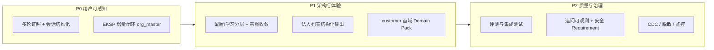

# 企业级知识库建设：待解决问题与挑战

> 版本：2026-05-28  
> 状态：盘点文档（汇总既有设计与实测结论，非正式需求规格）  
> 关联：[已知问答问题](./enterprise-qa-known-issues.md)、[知识沉淀指南](./knowledge-sedimentation-guide.md)、[企业知识同步平台（EKSP）](./enterprise-knowledge-sync-platform.md)、[`openspec/backlog.md`](../openspec/backlog.md)

本文档从**数据同步 → 沉淀写入 → 检索问答 → 运营治理**全链路，归纳 SmartQA-Framework 在构建企业级知识库时**尚未闭环的能力**与**结构性挑战**，便于评审排期与 OpenSpec 立项。细节以各专题文档为准，此处侧重「问题地图」与优先级。

---

## 1. 建设目标与当前形态（简要）

系统采用 **多源检索**（Neo4j 图谱、Qdrant 向量、业务 MySQL 实时 SQL、主动学习文本）+ **LLM 生成** 的企业问答架构。知识进入系统有两条主路径：

| 路径 | 作用 | 当前成熟度 |
|------|------|------------|
| **Bulk Pipeline**（Python 灌库） | 公司/人员/证照等企业主数据 → Neo4j + Qdrant | 可用，但偏**全量 wipe**、难增量 |
| **主动学习**（Java 在线） | 制度、别名、Schema 说明、对话「记住…」 | 可用，但**未接入意图路由**；问答召回多走 MySQL 关键词 |
| **Live SQL** | 实时明细、聚合、列表 | 可用，与图谱/向量**编排与闸门**仍待加强 |

企业级知识库要「可用、可演进、可治理」，需在上述三层之上补齐：**增量同步、域扩展、多轮会话结构化、配置与学习分层、质量与安全**。下文按维度展开。

---

## 2. 挑战总览（结构性，非单点 Bug）

以下挑战决定排期与架构投入，往往不能靠改一行配置解决。

### 2.1 三套系统割裂

| 系统 | 数据新鲜度 | 与问答关系 |
|------|------------|------------|
| Bulk 灌库（Neo4j / `enterprise_knowledge_v2`） | 依赖离线/全量脚本，业务变更**不能自动**反映 | 关系穿透、语义检索主通路 |
| `ScheduledSyncService` | 仅比对**行数**，变更内容检测不到；占位 Markdown **不写**图谱/向量 | 与 Bulk 未打通 |
| Live SQL + 主动学习 | 实时或在线写入 | 结构化列表、补充事实；**未统一**到「执行目录」 |

**挑战：** 需将灌库升级为 **EKSP（企业知识同步平台）**：增量 upsert、实体级状态、Domain Pack，并重写定时同步为真正 incremental job（见 [enterprise-knowledge-sync-platform.md](./enterprise-knowledge-sync-platform.md)）。

### 2.2 控制面 vs 表达面混在配置里

`business-rules.json`、`enterprise-lexicon.json` 同时承载：

- **执行目录**（queryType → 检索器、物理表、闸门阈值）——适合版本化、审计、DB 沉淀；
- **语义目录**（「证」≈证照、多轮追问规则）——适合运营确认后的路由 hint 或审核过的学习集。

主动学习（`qa_active_knowledge` / Qdrant）主要服务**事实补充**，**未接入**意图路由与结构化 SQL 开关。

**挑战：** 用户期望「新说法、新场景由学习自动生效」，与当前「改 JSON 发版」双轨并存，形成长期**架构债**（见 [enterprise-qa-known-issues.md](./enterprise-qa-known-issues.md) §4、Q-05/Q-06）。

### 2.3 写入三库 ≠ 召回三库

主动学习写入 MySQL + Qdrant + Neo4j（`LearnedKnowledge`），但问答阶段对主动学习**当前走 MySQL 关键词**；Qdrant 主动学习集合、Neo4j 学习子图**未接入**主检索链（预留能力）。

**挑战：** 三库一致性、嵌入模型变更后的**全量 re-embed**、去重与版本策略需在「召回真正用上向量/图谱」前设计清楚（见 [knowledge-sedimentation-guide.md](./knowledge-sedimentation-guide.md) §9）。

### 2.4 生成层与证据层脱节

即使有充足 SQL/图谱证据，**列表类答案仍由 LLM 归纳**，可能出现条数偏差（如法人 26 家答成 25）、分组与库不一致。多轮追问时，上一轮主体名单只存在于**自然语言答案**，未结构化进会话，导致下一轮检索无法按「存续 14 家」批量查证照。

**挑战：** 需在「检索召回」与「回答生成」之间增加**结构化会话状态**、题型相关闸门、必要时模板化/条数校验输出。

### 2.5 域扩展与单体灌库脚本

`build_knowledge_from_mysql.py` 以 **Company 为锚**，硬编码 tdcomp 多表；合同、客户、商机等需不同实体锚点、关系模型、向量模板及 Java 侧 Intent/Graph/SQL 配套。

**挑战：** 每新增一域即改单体脚本不可持续；需 **Domain Pack + `sync-manifest.yaml` + Canonical JSONL**（EKSP Phase 0～2）。

### 2.6 规模、安全与可测试性

- 结构化接入默认 **&lt; 10000 行**（`spec.md`）；更大规模需单独定义分页与索引策略。
- SQL 白名单、schema 级权限、敏感列脱敏在 spec 中**尚未单列 Requirement 并全面落实**。
- 缺少 **Testcontainers**（或同类）对 MySQL + Neo4j 最小链路的集成测试；评测脚本与固定用例仍在推进中。

---

## 3. 待解决问题清单（按领域）

### 3.1 数据同步与知识新鲜度（P0～P1）

| ID | 问题 | 影响 | 方向 / 状态 |
|----|------|------|-------------|
| S-01 | 业务 MySQL 变更无法增量同步到 Neo4j/Qdrant | 问答基于过期图谱/向量 | EKSP：水位/`content_hash`、`sync_entity_state`、稳定 point id upsert |
| S-02 | 日常运维依赖 `sync_neo4j.py --wipe` 全量重建 | 停机窗口、不可观测 | `--wipe` 仅灾难重建；常规 incremental |
| S-03 | Qdrant point id 不稳定 | 实体更新难以同 id 覆盖 | 稳定 hash：`domain + entity_type + entity_id` |
| S-04 | `ScheduledSyncService` 不写真实知识 | 定时任务无业务价值 | 重写为触发 EKSP incremental job |
| S-05 | tdcomp 外域（合同/客户/商机）无灌库与图谱 | 无法回答跨域关系问题 | Domain Pack 分阶段：customer → contract → opportunity |
| S-06 | 删除/软删未传播到图谱与向量 | 脏数据、误召回 | Tombstone / `deleted` 标记 + 检索过滤 |

**参考：** [enterprise-knowledge-sync-platform.md](./enterprise-knowledge-sync-platform.md)、[knowledge-sedimentation-guide.md](./knowledge-sedimentation-guide.md) §2、[scripts/enterprise_pipeline/README.md](../scripts/enterprise_pipeline/README.md)

---

### 3.2 问答与多轮会话（P0）

| ID | 问题 | 典型现象 | 方向 / 状态 |
|----|------|----------|-------------|
| Q-02 | 多轮「存续主体的证照」题型未切换 | `queryType` 仍为 `person_role_list`，无证照 SQL 证据却闸门放行 | 追问规则强制 `company_certificate` / `person_certificate_list`；口语「证」识别 |
| Q-02b | 会话无结构化主体列表 | `focusCompanyNames` 仅约 2 家；14/18 家存续名单未落库 | 首轮任职结果写入 `session.lastRoleList`（来自 SQL/图谱） |
| Q-02c | `companyHints` 未驱动证照 SQL | 已抽公司名仍走错误检索通路 | `retrieveByCompanyNames` + 存续过滤 |
| Q-02d | 证照题闸门不校验证据类型 | 任职证据即可生成「证据无证照」类回答 | 无 `mysql-*-certificate` 则拒答或二次检索 |
| Q-04 | 首轮法人列表条数/分组偏差 | 26 家答 25、存续数不一致 | 模板/表格输出或「结论条数 = 证据条数」后处理；部分缓解 |

**参考：** [enterprise-qa-known-issues.md](./enterprise-qa-known-issues.md)（Q-02、Q-04、§5 P0）

---

### 3.3 检索编排与意图（P1）

| ID | 问题 | 说明 |
|----|------|------|
| R-01 | `business-rules.json` 与 `enterprise-lexicon.json` 意图规则重复 | 维护成本高、易漂移 |
| R-02 | 意图**单一权威源**未收敛 | 需合并 queryType 规则并明确优先级 |
| R-03 | 新域 Intent / Graph / SQL 未配套 | EKSP 新域需同步扩展 `IntentRouterService`、`GraphContextService` 等 |
| R-04 | 多租户 / 全元数据驱动表映射 | 当前部分表名可配，完整元数据驱动仍为后续 |
| R-05 | 向量集合命名 `enterprise_*` 与「通用助手」定位 | 宜改为可配置前缀（技术债） |

---

### 3.4 沉淀、学习与反馈闭环（P1）

| ID | 问题 | 说明 |
|----|------|------|
| L-01 | 待沉淀队列 `qa_pending_knowledge` **不自动**写入图谱/向量 | 需人工审核后再调学习 API |
| L-02 | 消费/审核/再学习**状态机**可后续迭代 | backlog：沉淀队列深度能力 |
| L-03 | Schema/CSV 多次 `persist=true` **无自动去重** | 重复 `qa_active_knowledge` 记录 |
| L-04 | 点赞/点踩已落库，**分析看板/去重**待做 | 反馈驱动改进未产品化 |
| L-05 | 执行目录未 DB 化 | `business-rules` 宜作开发种子，生产以 DB + 流水线为准 |
| L-06 | 结构化接入：本应用**不执行**业务表 DML/LOAD | 外部 ETL 在 `ingest-gate` 通过后执行；大表需规格化分页策略 |

**参考：** [knowledge-sedimentation-guide.md](./knowledge-sedimentation-guide.md) §1、§9；[structured-ingest-gate.md](../openspec/design/structured-ingest-gate.md)

---

### 3.5 质量、评测与可观测性（P2）

| ID | 问题 | 说明 |
|----|------|------|
| T-01 | 固定回归用例不完整 | 需覆盖「法人 26 家」「多轮证照」等（`data/eval/`、`run_qa_eval.py` 进行中） |
| T-02 | 无证据路径集成测试不足 | `alignment-strict` 可配，但缺系统化用例 |
| T-03 | 追问策略不可观测 | 需结构化记录「为何追问」（缺槽位、哪路检索为空） |
| T-04 | Playground 可加强展示 | `queryType`、`retrievalSource`、证据 source 计数便于排障 |
| T-05 | `evidenceAlignment` 仅为启发式 | **不得**作为唯一安全闸门（spec 已约定） |

---

### 3.6 安全与合规（按需插队）

| ID | 问题 | 说明 |
|----|------|------|
| SEC-01 | SQL 白名单与 schema 级权限 | 须在 spec 中单列 Requirement 并落实 |
| SEC-02 | 敏感列脱敏 | EKSP manifest 级 `redact_columns` 等为 Phase 3 方向 |
| SEC-03 | 证照附件等 | 默认不导出扫描件表，仅元数据；合规策略需与业务对齐 |

---

## 4. 已缓解但需持续关注

| 主题 | 说明 |
|------|------|
| Q-01 法人列表召回不全 | 已修：`preferGraphOnly`、业务库 SQL、有害截断规则等；需确认部署最新产物 |
| Q-03 SSE 长时间无进度 | 已修：`onThinking` 参数、专用 executor、结构化问句规则优先等 |
| 结构化接入门禁 / 行审计 / CSV 学习 | 本应用范围内已完成（见 backlog） |
| 回答闸门无证据不调 LLM | `QaAnswerGateService` 已接入；**题型相关**闸门仍待加强（证照题） |
| Flyway 可选迁移 | 进行中；与 `assistant_bootstrap.sql` 职责需持续文档化 |

---

## 5. 建议优先级（与 backlog 对齐）

| 优先级 | 聚焦 | 代表条目 |
|--------|------|----------|
| **P0** | 多轮问答正确、知识不过期 | Q-02 全系；EKSP Phase 0（`sync_entity_state`、incremental upsert、重写 `ScheduledSyncService`） |
| **P1** | 可扩展、可运维 | 配置 DB 化与意图单一源；法人列表模板化；`crm_customer` Domain Pack |
| **P2** | 可度量、可合规 | `data/eval` 回归；Testcontainers；追问/trace 可观测；安全 spec 落实 |

完整任务状态见 [`openspec/backlog.md`](../openspec/backlog.md)。

---

## 6. 验证关注点（建设阶段性验收）

建设企业级知识库时，建议以场景驱动验收，而非仅「能灌库」：

- [ ] **新鲜度**：修改一条 `company`（或证照）记录 → 约定时间内图谱、向量、问答结果一致更新（无日常 wipe）。
- [ ] **单轮准确**：「戴先生是哪些主体的法人」→ 证据条数与业务库一致，回答主体数与 SQL 一致。
- [ ] **多轮连贯**：接上轮问「存续的主体有哪些证」→ `queryType` 为证照类，证据含 `mysql-company-certificate`，能按主体列证照。
- [ ] **学习闭环**：答不上来 → `qa_pending_knowledge` → 审核 → 学习 API → 下轮可检索（含别名/制度类）。
- [ ] **新域试点**：至少一个非 org_master 域（如 customer）完成 extract → canonical → upsert → 问答评测通过。
- [ ] **运维可观测**：Sync job 有 batch id、变更统计、失败可重跑；Playground/trace 可看到题型与证据来源分布。

详细问答自检项见 [enterprise-qa-known-issues.md](./enterprise-qa-known-issues.md) §7。

---

## 7. 文档与代码索引

| 主题 | 路径 |
|------|------|
| 问答已知问题与 P0 建议 | `docs/enterprise-qa-known-issues.md` |
| 沉淀机制与限制 | `docs/knowledge-sedimentation-guide.md` |
| 增量同步与域扩展方案 | `docs/enterprise-knowledge-sync-platform.md` |
| 任务排队 | `openspec/backlog.md` |
| 能力规格 | `openspec/specs/knowledge-assistant/spec.md` |
| 结构化门禁设计 | `openspec/design/structured-ingest-gate.md` |
| Schema 沉淀流水线 | `openspec/design/schema-sedimentation-plan-pipeline.md` |
| 灌库脚本 | `scripts/enterprise_pipeline/` |

---

## 8. 变更记录

| 日期 | 说明 |
|------|------|
| 2026-05-28 | 初版：汇总企业知识库建设待解决问题、结构性挑战及优先级，对齐 known-issues、EKSP、sedimentation-guide、backlog |
