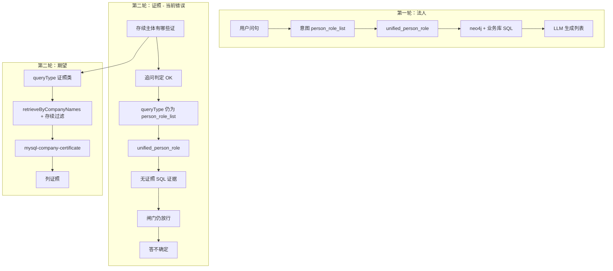

# 企业问答已知问题与改进方向（沉淀文档）

> 版本：2026-05-27  
> 状态：问题盘点 / 部分已修复（见各节「修复状态」）  
> 关联：[人物证照方案](./person-certificate-qa-plan.md)、[架构总览](./architecture.md)、[企业常识事实](./enterprise-canonical-facts.md)、`openspec/specs/knowledge-assistant/spec.md`

本文档汇总 Playground 实测与代码走读中暴露的问题，便于评审、排期与 OpenSpec 变更立项。**不替代** `spec.md` 中的正式需求。

---

## 1. 问题总览

| ID | 主题 | 严重程度 | 修复状态 |
|----|------|----------|----------|
| Q-01 | 法人主体列表召回不全（应为 26 家，仅 2 条图谱证据进模型） | P0 | 已修复（见 §2.1） |
| Q-02 | 多轮「存续主体的证照」无法作答（检索仍走任职、证据无证照） | P0 | 部分修复（见 §2.2、§2.6） |
| Q-07 | 全局证照筛选被锁死在会话主体；「不是存续」误判为存续过滤 | P0 | 部分修复（见 §2.6） |
| Q-03 | SSE 流式卡在「已接收问题，开始分析」 | P0 | 已修复（见 §2.3） |
| Q-04 | 首轮法人答案条数/存续分组与库不一致（如 25 vs 26、14 vs 18） | P1 | 部分缓解 |
| Q-05 | 业务规则大量落在配置文件，与学习沉淀双轨未打通 | P1 | 架构债，见 §4 |
| Q-06 | `business-rules.json` 与 `enterprise-lexicon.json` 意图规则重复 | P2 | 未收敛 |

---

## 2. 已识别问题（现象 · 根因 · 状态）

### 2.1 Q-01：法人列表召回不全

**典型问句**：戴先生是哪些主体的法人  

**现象**

- Trace 显示 `person_role_list` + `legal_rep`，送入模型的证据仅少量 `neo4j-person-role`（如 2 条），回答只列 2 家主体。
- 业务库 `tdcomp.company` 中 `legal_rep_id=29`（戴科彬）实际为 **26 家**；JSONL / 全量 Neo4j 同步后亦可查到 26 条。

**根因（多层叠加）**

1. `RetrievalPlan.preferGraphOnly=true`（`person_role_list`）→ 图谱有结果后不再走 SQL / 业务 MySQL。
2. `SqlPersonRoleRetriever` 曾对 `person_role_list` 直接 `skip`；且 SQL 连 `assistant` 库而非业务库 `tdcomp`。
3. `business-rules.json` 曾配置「`neo4j-person-role` ≥3 条时整包证据裁到 3 条」，进一步压低条数。
4. Trace 中「2 条」多指**送入模型的证据片段**，不等于图谱物理只有 2 条。

**已做修复（代码层，需确认部署的是最新编译产物）**

- `RetrievalPlan.preferGraphOnly` 改为 `false`。
- `SqlPersonRoleRetriever`：不 skip；连业务 MySQL；支持 `personEmployeeId`；按 `roleFocus` 过滤。
- `SqlQueryService`：任职查询 `retrievePersonRoleFromBusinessDb`。
- `person_role_list` 跳过配置化有害截断；删除 business-rules 中有害的 neo4j 截断规则。
- 验证：`queryType=person_role_list`，通路 `unified_person_role`，证据约 27 条，回答可列全 26 家。

**残留风险**

- 若仍走旧 JAR / 未重启，现象会复现。
- 回答层仍可能因 **LLM 归纳** 漏列（见 Q-04），与召回条数无关。

---

### 2.2 Q-02：多轮追问证照 —— 「有关联展示、无关联作答」

**典型序列**

1. 第一轮：戴先生是哪些主体的法人（大致正确，见 Q-01 / Q-04）。
2. 第二轮：存续的主体中，现在有那些证，分别列一下  

**现象**

- Playground「问题理解」显示已接续上一轮（`followUpApplied`、拼接 `[上文]`、会话锚点戴科彬）。
- 意图 LLM 理由写「查证照表」，但 **`queryType=person_role_list`**，`retrievalSource=unified_person_role`。
- 证据为 `neo4j-person-role`、员工身份等，**无** `mysql-company-certificate` / `mysql-person-certificate`。
- 闸门 `允许生成：是`，模型答「证据未包含证照信息」类不确定结论。

**根因**

| 层级 | 说明 |
|------|------|
| 题型未切换 | `enrichIntentForFollowUp` / `inheritIntentSlots` 仅在 `queryType` **为空** 时继承上一轮；LLM 已填 `person_role_list` 则不会改为证照类。 |
| 关键词不匹配 | 用户写「**证**」；规则与 `mergeSessionCompanyHints` 多要求「**证照**」；`person_role_list` 含「主体」易误命中。 |
| 检索绑定 queryType | `appendPersonCertificateIfNeeded` 仅在 `plan.personCertificateList()` 为真时执行；`intent=mysql` **不**改变检索通路。 |
| 会话无结构化主体集 | `focusCompanyNames` 来自 `extractFocusCompanyNames(evidence)`，**最多约 2 家**；14/18 家存续名单只在**自然语言答案**里，未落库。 |
| companyHints 未驱动 SQL | 虽从长上下文抽出约 17 家公司名，因 `queryType` 错误，未调用 `retrieveByCompanyNames(..., activeCompaniesOnly)`。 |
| 闸门不校验证据类型 | `person_certificate_list` 要求证照 source；`person_role_list` 只检查条数/分数，任职证据即可放行生成。 |

**修复状态**：**部分修复**（2026-06）：`conversationScope` 配置化断链/全局列表；`IntentScopeNormalizer` 断链时清空人物/公司 hints；经营状态与证照「有效」歧义由 `ConversationScopeSupport` 处理。题型切换（任职→证照）与闸门按证据拒答仍待加强。

**建议方向（摘要）**

- 追问规则：上一轮 `person_role_list` + 本轮证照语义 → 强制 `company_certificate` / `person_certificate_list`。
- 首轮结束写入 `session.lastRoleList`（来自 SQL/图谱，非生成文本）。
- 证照类闸门：无 `mysql-*-certificate` 则拒答或触发二次检索。

详见 §5 P0 条目。

---

### 2.6 Q-07：全局合规清单被会话锁死 + 「不是存续」过滤反了

**典型问句**：忽略之前的问题，列出现在主体不是存续、但证照状态有效的所有证照

**现象（修前）**

- 仍锚定上一轮人物/12 家公司；MySQL 显示 `主体状态范围=存续`；仅答 2 家 5 条（复述对话片段）。

**根因**

- `explicitlyBreaksContext` 未含「忽略之前的问题」；`isContinuationUtterance` 将「不是」误判为短追问。
- `question.contains("存续")` 对「不是存续」为真 → `activeCompaniesOnly=true`。
- `inferStatusScope` 将证照「有效」与主体「存续」混为一谈。
- 有 `companyHints` 时图谱不走全库 `queryByCertificateIntent`。

**已做修复（2026-06）**

- 新增 [`docs/platform-retrieval-architecture.md`](./platform-retrieval-architecture.md)；`business-rules.json` → `conversationScope`。
- `ConversationScopeSupport` + `IntentScopeNormalizer` + 全局 `retrieveGlobalFiltered`。
- 检索不再使用 `contains("存续")` 启发式。

**残留**

- `PersonCertificateQueryService` 仍为过渡实现；CRM/文档需新 Connector。
- MySQL `company_id` 列与部署库不一致时仍会降级。

---

### 2.3 Q-03：SSE 长时间无进度 / 不回话

**现象**

- Playground 仅显示「已连接」「已接收问题，开始分析」，之后长时间无 `prep` / `decompose` 等事件。

**根因**

1. **编译错误导致异步线程崩溃**：`QaAskFlowService` 中 `progress.onThinking("retrieve", "知识检索", <String>)` 将说明文字误作第三参数（应为 `Map`），`qa-sse-worker` 抛 `Error` 后静默退出。
2. 首包过晚：此前需等待主动学习 MySQL + 意图 LLM（最长约 45s）且无中间心跳。
3. （曾）`CompletableFuture` 使用公共 ForkJoinPool，存在饥饿风险。

**已做修复**

- 修正 `onThinking` 参数；专用 `SSE_EXECUTOR`；每步 `flushBuffer`；入口 `start` + `prep` 进度。
- 结构化列表问句：`intent-rule-first-for-structured` 规则优先，跳过意图 LLM。
- `GET /qa/ask/stream` 补充 SSE 响应头。

**修复状态**：**已修复**（需使用最新编译并重启服务）。

---

### 2.4 Q-04：首轮法人答案数字与分组偏差

**现象**

- 助手答「25 家法人」「存续 14 家」等，与业务库 26 家、或用户认知的存续数量不一致。

**根因**

- 回答由 **LLM 归纳** 证据/上下文，非按 SQL 结果逐条枚举。
- 会话未保存结构化任职列表，无法在 UI 或下一轮核对。

**修复状态**：**部分缓解**（召回修好后证据更全，但生成层仍可能漏列）。

**建议方向**

- 有充足 `mysql-sql-person-role` / 图谱任职证据时，模板化列表或强制「结论条数 = 证据条数」后处理。
- 首轮将任职结果结构化写入会话（为 Q-02 铺路）。

---

### 2.5 Q-05 / Q-06：配置化业务规则 vs 主动学习

**现象**

- `business-rules.json`、`enterprise-lexicon.json` 含大量企业域关键词、表名（如 `certificate_management`）、输出契约。
- 用户期望：新说法、新场景由**学习沉淀落库**自动生效，而非改配置发版。

**根因（架构）**

- 近期演进是 **Java 硬编码 → JSON 配置**，主动学习通路（`qa_active_knowledge` / Qdrant / `LearnedKnowledge`）主要服务**语义事实补充**，**未接入**意图路由与结构化 SQL 开关。
- 同一文件混合 **控制面**（题型、表映射、闸门）与 **表达面**（输出契约），看起来像「都可配置」，实则只有前者适合静态配置。

**修复状态**：**架构债**，见 §4。

---

## 3. 关键链路说明（便于对照 Trace）

---

## 4. 配置 vs 学习：分层建议（原则）

| 类型 | 示例 | 建议存放 | 变更方式 |
|------|------|----------|----------|
| **执行目录** | queryType → 检索器、物理表、列、闸门阈值 | DB / schema 沉淀流水线产出 | 版本 + 审计，非聊天写入 |
| **语义目录** | 「证」≈证照、多轮证照追问、别名 | `qa_routing_hint` 或审核后的主动学习集合 | 运营确认 / 反馈队列 |
| **事实知识** | 制度文档、说明性文本 | 主动学习 + 向量 + 文档 | 用户「记住」/ 批量灌库 |

`business-rules.json` 宜保留为**开发环境种子**；生产逐步以 DB 为准，并**合并**与 `enterprise-lexicon.json` 的重复规则。

---

## 5. 改进 backlog（建议优先级）

### P0（直接对应用户痛点）

1. **追问题型切换**：`person_role_list` → 证照追问时改 `company_certificate` / `person_certificate_list`；支持「证」单字。
2. **会话结构化主体列表**：首轮任职结果写入 turn/session；「存续」过滤在检索层执行。
3. **按 companyHints + 存续调用** `PersonCertificateQueryService.retrieveByCompanyNames`。
4. **证据闸门按题型**：证照题无 `mysql-*-certificate` 不准生成（或自动二次检索）。

### P1（体验与架构）

5. 法人列表：**模板/表格输出**或条数校验，减少 LLM 漏列。
6. 拆分 `business-rules.json`：执行目录 DB 化；语义目录可沉淀。
7. 意图**单一权威源**（合并 lexicon 与 business-rules 的 queryType 规则）。

### P2（质量）

8. 回归用例：`data/eval/` 或脚本固定「法人 26 家」「多轮证照」场景。
9. Playground 展示 `queryType`、`retrievalSource`、证据 source 计数。
10. CI：`mvn compile` + SSE 线程异常必打 ERROR。

---

## 6. 相关代码与配置（索引）

| 模块 | 路径 |
|------|------|
| 会话范围 / 平台化说明 | `qa/domain/ConversationScopeSupport.java`、`docs/platform-retrieval-architecture.md` |
| 问答主流程 | `qa/orchestration/QaAskFlowService.java` |
| SSE | `qa/orchestration/QaAskOrchestrator.java`、`QaSseStreamSupport.java` |
| 多轮会话 | `qa/response/QaConversationService.java`、`qa/domain/ConversationSessionSupport.java` |
| 意图 | `qa/intent/IntentRouterService.java`、`IntentDecisionEnricher.java`、`IntentRuleEngine.java` |
| 统一召回 | `qa/retrieval/QaRetrievalPipeline.java` |
| 法人 SQL | `qa/retrieval/sql/SqlPersonRoleRetriever.java`、`SqlQueryService.java` |
| 证照 SQL | `qa/retrieval/personcert/PersonCertificateQueryService.java` |
| 闸门 | `qa/answer/QaAnswerGateService.java` |
| 业务规则 | `src/main/resources/qa/business-rules.json` |
| 词典（重复） | `src/main/resources/qa/enterprise-lexicon.json` |
| 主动学习 | `qa/learning/ActiveLearningService.java` |

---

## 7. 验证清单（修完后自检）

- [ ] 单轮：戴先生是哪些主体的法人 → `unified_person_role`，证据含业务库任职，回答主体数 ≥26（或与 SQL 一致）。
- [ ] 多轮：接上轮问「存续的主体有哪些证」→ `queryType` 为证照类，证据含 `mysql-company-certificate`，能按主体列证照。
- [ ] SSE：连接后 1s 内可见 `prep`；无 `qa-sse-worker` 未捕获异常。
- [ ] 口语「证」可识别为证照意图（不误判为纯 `person_role_list`）。

---

## 8. 变更记录

| 日期 | 说明 |
|------|------|
| 2026-05-27 | 初版：汇总法人召回、多轮证照、SSE、配置/学习分层及 P0–P2 建议 |
| 2026-06-02 | Q-07：conversationScope、全局证照检索、平台化架构文档 |
