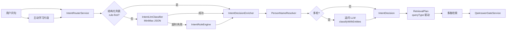

# 意图识别：现状评估与改进计划

> 版本：2026-05-29  
> 状态：评估 / 待实施  
> 关联：[企业知识库通用化重构方案](./enterprise-kb-generic-refactoring-plan.md)（**总方案**）、[企业问答已知问题](./enterprise-qa-known-issues.md)（Q-02、Q-05、Q-06）、[架构总览](./architecture.md)、`openspec/specs/knowledge-assistant/spec.md`  
> 背景：CDC 数据同步已验证「库表更新 → 问答自动反映」；下一阶段重点增强**意图识别**，使检索通路与多轮对话与企业级知识库场景匹配。

本文档汇总当前意图识别实现、不足、改进方向与分阶段工作计划，供评审与排期。**不替代** `spec.md` 中的正式需求。

---

## 1. 当前实现概览

### 1.1 整体链路



主入口：`QaAskFlowService` → `IntentRouterService.decide()` → `QaConversationService.enrichIntentForFollowUp()` → 以 `IntentDecision` 构建 `RetrievalPlan` 并执行检索。

### 1.2 核心组件

| 组件 | 路径 | 职责 |
|------|------|------|
| **IntentRouterService** | `qa/intent/IntentRouterService.java` | 结构化列表可走规则优先跳过 LLM；否则 LLM（可超时）→ 规则兜底 |
| **IntentRuleEngine** | `qa/intent/IntentRuleEngine.java` | 基于 `enterprise-lexicon.json` 的 `routingKeywords` 选择检索通道 |
| **IntentLlmClassifier** | `qa/intent/IntentLlmClassifier.java` | 单轮 `classify()`；多轮 `classifyWithEntities()`，输出 JSON 槽位 |
| **IntentSlots** | `qa/intent/IntentSlots.java` | 合法值校验、人名清洗、`isRetrievalReady()` |
| **IntentDecisionEnricher** | `qa/intent/IntentDecisionEnricher.java` | 补全槽位；高置信 LLM 可跳过规则覆盖；人名消歧 |
| **ScenarioRuleEngine** | `qa/domain/ScenarioRuleEngine.java` | 读取 `business-rules.json` 做 queryType、人名模式匹配 |
| **QuestionEntityExtractor** | `qa/domain/QuestionEntityExtractor.java` | 规则侧实体抽取（与 LLM 互补） |
| **CompanyClarificationAdvisor** | `qa/intent/CompanyClarificationAdvisor.java` | 「我们公司」等歧义主体澄清 |
| **PersonClarificationAdvisor** | `qa/intent/PersonClarificationAdvisor.java` | 敬称/歧义人名澄清 |

### 1.3 决策模型：双轴设计

`IntentDecision`（`qa/core/IntentDecision.java`）将两类概念分离：

| 字段 | 含义 | 典型取值 |
|------|------|----------|
| **intent** | 检索通道 | `graph`, `vector`, `mysql`, `sql`, `hybrid`, `document`, `unknown` |
| **queryType** | 查询形态（业务题型） | `person_role_list`, `person_certificate_list`, `company_certificate`, `company_profile`, … |
| **槽位** | 检索锚点 | `personName`, `personEmployeeId`, `companyHints`, `roleFocus` |

**重要**：实际检索通路主要由 **queryType** 驱动（`RetrievalPlan.personRoleList()` / `personCertificateList()`），而非单独的 `intent`。例如 `intent=mysql` 若 `queryType` 仍为 `person_role_list`，仍会走任职统一召回。

### 1.4 路由策略（IntentRouterService）

1. 先跑规则得到 `ruleFirst`。
2. 若开启 `intent-rule-first-for-structured` 且为「结构化列表就绪」（`person_role_list` / `person_certificate_list` 且槽位齐全）→ **直接用规则**，不调 LLM。
3. 否则若开启 `intent-llm-enabled` 且有 API Key → 异步 LLM，`intent-llm-timeout-ms`（默认 45000ms）超时则规则兜底。
4. 结果经 `IntentDecisionEnricher.enrich()`：补槽、人名解析、来源前缀写入 `reason`。

### 1.5 多轮追问（QaConversationService）

- `enrichIntentForFollowUp()`：有会话历史时调用 `IntentLlmClassifier.classifyWithEntities()`（专用 prompt：`followUpIntentRouterSystemPrompt`）。
- LLM 失败时 fallback：`ConversationSessionSupport.inheritIntentSlots()`（仅在 **queryType 为空** 且为接续 utterance 时继承上一轮）。
- `mergeSessionEntityHints()`：指代性追问时合并上一轮 `EntityRef` / `focusCompanyNames`。

### 1.6 配置与 Prompt

| 资源 | 说明 |
|------|------|
| `src/main/resources/qa/enterprise-lexicon.json` | 路由关键词、queryType 规则、人名/公司抽取词表 |
| `business-rules.json`（经 `BusinessRulesConfig`） | 与 lexicon 部分重叠的 queryType、人名模式、截断规则 |
| `KnowledgeAssistantPrompts` | `intentRouterLlmSystemPrompt()` / `followUpIntentRouterSystemPrompt()` |
| `application.properties` | `qa.assistant.intent-llm-enabled`、`intent-rule-first-for-structured`、`intent-llm-enrich-min-confidence`、`intent-llm-timeout-ms` |

### 1.7 下游消费

| 环节 | 如何使用意图 |
|------|----------------|
| **RetrievalPlanFactory** | 由 queryType 设置 graphTopK、evidenceTopK |
| **QaRetrievalPipeline** | `person_role_list` → `unified_person_role`；`person_certificate_list` → 证照 SQL；否则 hybrid/单路 |
| **QaAnswerGateService** | `unknown` 可拒答；`person_certificate_list` 要求证照 evidence source |
| **MiniMax 生成** | `queryType` 关联输出契约（`AnswerOutputContractRegistry`） |

### 1.8 已具备的优势

1. **槽位与通道分离**，便于扩展证照、任职、统计等题型。
2. **LLM + 规则 + enrich 三层**，兼顾口语化与可预期性。
3. **结构化列表 rule-first**，降低延迟与 LLM 抖动（如法人列表）。
4. **人名解析链**（敬称、别名、`personEmployeeId`）已接入检索。
5. **CDC 数据更新**已能反映到问答；意图层与数据层解耦，架构方向正确。

---

## 2. 主要不足

### 2.1 P0：多轮「题型切换」失效（对应 Q-02）

**典型序列**

1. 第一轮：「{某人}是哪些主体的法人」→ `person_role_list`，大致正确。
2. 第二轮：「存续的主体中，现在有那些证，分别列一下」→ 应切换为证照类 queryType。

**现象**

- 追问判定、`followUpApplied`、上下文拼接正常。
- LLM 理由可能写「查证照表」，但 **queryType 仍为 `person_role_list`**。
- 检索 `unified_person_role`，证据为任职/身份，**无** `mysql-company-certificate`。
- 闸门对 `person_role_list` 仅检查条数/分数，**仍放行生成** → 模型答「证据无证照」。

**根因**

| 层级 | 说明 |
|------|------|
| 追问 LLM | `enrichIntentForFollowUp` 直接采用 LLM 的 queryType，**无规则纠偏**（单轮 enrich 的 queryType 校正未在追问路径复用） |
| 关键词 | 「证」未等价「证照」；`routingKeywords.relation` 含「证照/法人」等，易误判为关系/任职 |
| 继承逻辑 | `inheritIntentSlots` 仅在 queryType **为空** 时继承；LLM 填错则不会纠正 |
| 闸门 | 仅 `person_certificate_list` 严格校验证照 source；`company_certificate` 及错配的 `person_role_list` 不拦截 |
| 会话状态 | `focusCompanyNames` 多来自证据截取（约 2 家）；**26 家法人主体未结构化落会话**，无法批量按存续查证照 |

### 2.2 P1：配置双轨与「学习」未接入意图

- `enterprise-lexicon.json` 与 `business-rules.json` 的 queryType / 关键词**重复且可能不一致**（Q-06）。
- 主动学习主要补语义事实，**未反哺**意图路由与闸门（Q-05）。
- CDC 更新业务数据，但「证≈证照」「主体≈公司」等**语义目录仍为静态 JSON**，变更需发版。

### 2.3 P1：intent 与 queryType 约束弱

- 规则层先定 intent，queryType 由另一套推断，**可能矛盾**（如 `intent=mysql` + `queryType=person_role_list`）。
- unified 路径下 `intent` 对 Trace 有误导性。
- `IntentSlots.isRetrievalReady()` 对部分通道较宽松，可能**过早跳过 enrich**。

### 2.4 P1：实体抽取与企业表达多样性

- 人名校验 `[\p{IsHan}·]{2,12}`，外籍名、工号问法支持弱。
- 公司 hint 依赖后缀窗口，简称、信用代码覆盖不全。
- `roleFocus=any` 时任职列表检索精度下降。

### 2.5 P2：可观测性与质量闭环

- 无意图路由准确率、LLM/规则冲突率、追问切换成功率等指标。
- 无固定回归集（法人 26 家、多轮证照、统计 SQL 等）。
- LLM 失败静默 fallback，缺少结构化日志区分 timeout / invalid JSON / unknown。

### 2.6 P2：性能

- 非结构化问句仍可能等待意图 LLM 至 45s（仅 structured rule-first 绕过）。
- 单轮与追问各调一次 LLM，决策可能不一致。

---

## 3. 改进原则（企业级知识库分层）

与 [enterprise-qa-known-issues.md §4](./enterprise-qa-known-issues.md) 一致：

| 类型 | 示例 | 建议存放 | 变更方式 |
|------|------|----------|----------|
| **执行目录** | queryType → 检索器、物理表、列、闸门阈值 | DB / schema 沉淀 | 版本 + 审计 |
| **语义目录** | 「证」≈证照、多轮证照追问、主体/公司同义 | `qa_routing_hint` 或审核后的学习集合 | 运营确认 / 反馈队列 |
| **事实知识** | 制度、说明文本 | 向量 / 文档 / CDC（已打通） | 灌库 / CDC |

意图增强重点：**让 queryType 成为检索与闸门的唯一权威**，并与**会话结构化状态**强绑定。

---

## 4. 改进方向摘要

1. **追问 queryType 纠偏**：规则优先于错误 LLM（上轮任职 + 本轮证照语义 → 强制切换）。
2. **会话结构化主体列表**：首轮任职结果写入 turn/session（SQL/图谱来源，非 LLM 文本）。
3. **闸门按 queryType 收紧**：证照题无 `mysql-*-certificate` 则拒答或二次检索。
4. **配置单一权威源**：合并 lexicon 与 business-rules 的 queryType 规则。
5. **queryType 优先路由**：先定题型，再推导 intent 与 RetrievalPlan。
6. **评估与指标**：黄金用例 + CI + 意图路由日志。

---

## 5. 分阶段工作计划

### 阶段 0：基线与度量（约 3–5 天）

| ID | 任务 | 产出 |
|----|------|------|
| 0.1 | 整理 15–20 条黄金用例（单轮任职/证照/概况/统计 + 多轮切换 + 澄清） | `data/eval/intent-routing-cases.jsonl` |
| 0.2 | Playground / trace 固定展示：`intent`, `queryType`, `reason`, `routeSource`, LLM vs rule | 便于 CDC 前后对比 |
| 0.3 | 意图路由结构化日志（timeout、fallback、纠偏命中） | 排障与指标 |

**验收**：任意一条用例可复现完整意图决策链路与检索 source。

---

### 阶段 1：P0 多轮题型切换（约 1–2 周）

| ID | 任务 | 说明 |
|----|------|------|
| 1.1 | 追问 **queryType 纠偏器** | 例：上轮 `person_role_list` + 本轮含 `证/证照/许可证` → `company_certificate` 或 `person_certificate_list` |
| 1.2 | 扩展 lexicon | 「证」单字、存续过滤触发词 |
| 1.3 | **会话结构化主体列表** | 首轮结束写入 `turn.lastRoleList` / `EntityRef[]`（来自 SQL/图谱） |
| 1.4 | 追问 **存续过滤 + 批量证照检索** | `retrieveByCompanyNames` + session 主体集 |
| 1.5 | **闸门按 queryType 收紧** | `company_certificate` 及证照追问均需证照 evidence；错配则拒答或二次检索 |
| 1.6 | 追问路径复用 **IntentDecisionEnricher** | LLM 输出后仍 enrich + 校验 `shouldSkipRuleEnrich` |

**验收**

- 序列「法人列表 → 存续主体有哪些证」：`queryType` 为证照类，`retrievalSource` 含 `mysql-company-certificate`，能列出证照。
- 闸门在无证照证据时不调用生成（或自动补检索）。

---

### 阶段 2：P1 意图架构收敛（约 2–3 周）

| ID | 任务 | 说明 |
|----|------|------|
| 2.1 | **queryType 优先路由** | 先定 queryType，映射表推导 intent + RetrievalPlan |
| 2.2 | 合并 lexicon + business-rules | 单一 `routing-catalog` 或 DB 表，消除 Q-06 |
| 2.3 | **LLM / 规则一致性检查** | 不一致时降置信、强制 enrich 或 hybrid |
| 2.4 | 意图结果缓存（问句 hash + 槽位） | 降低重复 LLM 延迟 |
| 2.5 | 主动学习 → 语义目录审核队列 | 用户纠错说法进入 `qa_routing_hint` |

**验收**：新增 queryType 仅改配置/目录，不改 Java 分支（符合 ScenarioRuleEngine 设计目标）。

---

### 阶段 3：P1/P2 体验与质量（约 2 周，可并行）

| ID | 任务 | 说明 |
|----|------|------|
| 3.1 | 法人/证照列表模板化或条数校验 | 缓解 Q-04（LLM 漏列） |
| 3.2 | 澄清顾问扩展至证照场景 | 人名 + 公司双澄清 |
| 3.3 | CI：`mvn test` + intent eval 脚本 | 防回归 |
| 3.4 | 指标：追问切换成功率、unknown 率、意图耗时 | 运营可见 |

---

### 阶段 4：长期（与 CDC / schema 沉淀联动）

- Schema/catalog 变更自动更新 queryType → 表/列映射（执行目录 DB 化）。
- 可选：轻量本地分类器预筛，复杂问句再调 LLM。
- 一问多子意图拆解与并行检索。

---

## 6. 推荐落地顺序

```
阶段 0（基线） → 阶段 1.1 + 1.5（纠偏 + 闸门）→ 阶段 1.3 + 1.4（会话 + 检索）
    → 阶段 2（架构收敛）→ 阶段 3（质量）→ 阶段 4（长期）
```

**优先理由**：CDC 已保证数据新鲜；当前最大用户感知问题是**多轮题型未切换导致答非所问**（Q-02），阶段 1 投入产出比最高。

---

## 7. 与已知问题文档对照

| 本文档阶段 | 已知问题 ID | 关系 |
|------------|-------------|------|
| 阶段 1 | Q-02 | 直接修复多轮证照 |
| 阶段 2 | Q-05、Q-06 | 配置与学习分层、规则收敛 |
| 阶段 3.1 | Q-04 | 生成层条数/模板 |
| — | Q-01、Q-03 | 检索/ SSE，非意图主线（已修复） |

---

## 8. 关键代码索引

| 主题 | 文件 |
|------|------|
| 路由入口 | `qa/intent/IntentRouterService.java` |
| 规则路由 | `qa/intent/IntentRuleEngine.java` |
| LLM 分类 | `qa/intent/IntentLlmClassifier.java` |
| 槽位 enrich | `qa/intent/IntentDecisionEnricher.java` |
| 追问 enrich | `qa/response/QaConversationService.java`（`enrichIntentForFollowUp`） |
| 会话继承 | `qa/domain/ConversationSessionSupport.java`（`inheritIntentSlots`） |
| Prompt | `knowledge/KnowledgeAssistantPrompts.java` |
| 词表 | `resources/qa/enterprise-lexicon.json` |
| 检索计划 | `qa/retrieval/RetrievalPlanFactory.java`、`qa/core/RetrievalPlan.java` |
| 答案闸门 | `qa/answer/QaAnswerGateService.java` |
| 编排 | `qa/orchestration/QaAskFlowService.java` |

---

## 9. 修订记录

| 日期 | 说明 |
|------|------|
| 2026-05-29 | 初版：CDC 验证后的意图识别评估与分阶段计划 |
| 2026-05-29 | 实现 v1：意图路由通用化（QueryTypeRoutingPolicy、追问并入 IntentRouterService、闸门配置化） |
| 2026-05-29 | 总方案见 [enterprise-kb-generic-refactoring-plan.md](./enterprise-kb-generic-refactoring-plan.md) |
