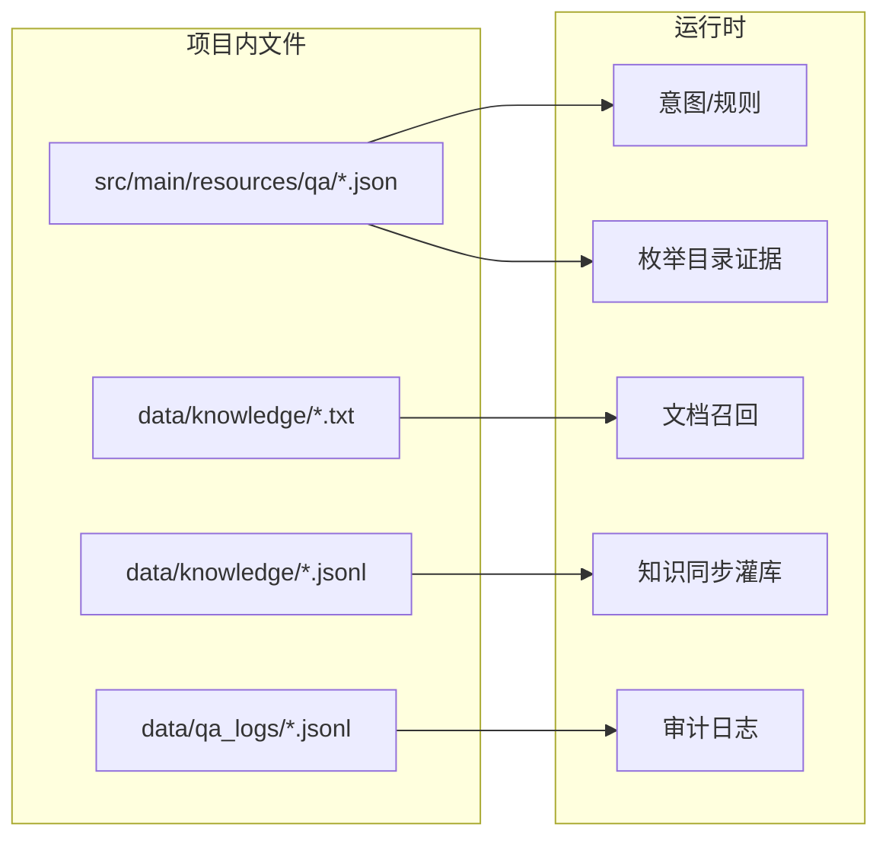
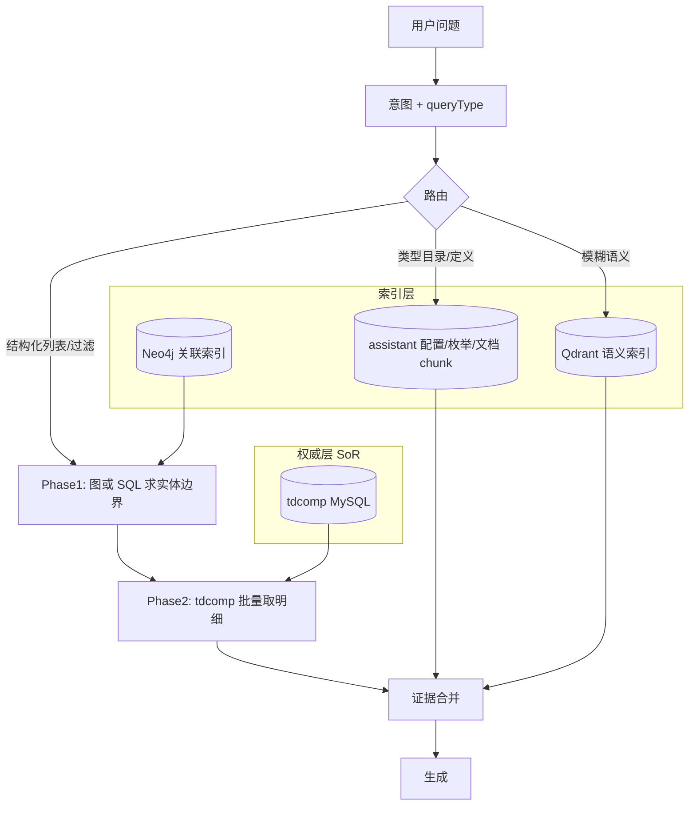

# 知识配置与镜像数据 MySQL 化迁移计划

> **状态**：已评审锁定（2026-06-01）· 实施前不再变更架构取向；代码按阶段落地。  
> **目标**：消除对项目仓库内 `data/knowledge/*`、大量 `classpath:qa/*.json` 的运行时依赖；配置与可版本化的知识镜像统一落入 `assistant` 库，检索时从 MySQL 读取，为多域接入（CRM、商机管理等）预留 `scope` / `domain` 维度。  
> **原则**：业务事实以 **tdcomp（MySQL）为权威源**；Neo4j / Qdrant 为 **索引与召回加速器**；本计划覆盖 **配置 MySQL 化、镜像入表、图谱职责收敛、检索编排调整**。

### 评审结论速览

| 类别 | 结论 |
|------|------|
| **架构取向（A1–A5）** | 全部同意（§3.2） |
| **配置存储（T1）** | `qa_config_bundle` **整包 JSON，首期不拆表** |
| **枚举（T2）** | `qa_enum_dict` + `qa_enum_entry` **确认** |
| **快照 / 文档 / 审计（T3–T5）** | 按原建议：`qa_entity_snapshot`、`qa_document_*`、`qa_audit_event`（P4/P3/P5） |
| **Flyway（T6）** | **V5__qa_config_and_knowledge_store.sql 确认** |
| **排期** | P0 → P1 → P2 → **P7** → P3 → P4 → P5 → P6；P7 与全量重同步同迭代 |
| **P7 范围** | G1–G7 **整包纳入** |

---

## 1. 阶段 0：删除测试与临时文件（先行）

## 1. 阶段 0：删除测试与临时文件（先行）

以下文件为本地验证产生，**不参与**正式知识链路；P0 清理并已由 `.gitignore` 防再提交。

| 路径 | 说明 | P0 状态 |
|------|------|---------|
| `data/qa_logs/_test_resp.json` | 单次 API 响应快照 | 待删（若仍存在） |
| `data/qa_logs/_test_after_change.json` | 变更后测试快照 | 待删（若仍存在） |
| `data/qa_logs/_check_now.json` | 临时检查输出 | 待删（若仍存在） |
| `data/qa_logs/_dai_legal_rep_check.txt` | 法人清单手工核对 | 待删（若仍存在） |
| `data/qa_logs/spring_run.log` | 启动日志（运行时） | **已删**；已 `.gitignore` |
| `Dprojectaidemodataqa_logsspring_run.log`（根目录乱码路径） | 错误重定向产物 | **已删**；已 `.gitignore` |
| `nul`（根目录） | Windows 空设备误创建 | **已删** |

**保留、按 P5 迁 MySQL 的运行日志**

| 路径 | 当前用途 |
|------|----------|
| `data/qa_logs/ask_events.jsonl` | 问答审计 |
| `data/qa_logs/feedback_events.jsonl` | 反馈审计 |
| `data/qa_logs/knowledge_candidates.jsonl` | 待学习候选 |
| `data/qa_logs/cdc_sync.jsonl` | CDC 写库审计（`qa.assistant.cdc-audit-log-path`） |

**`data/knowledge/` 业务镜像（本计划核心迁移对象，阶段 0 不删，迁完再弃文件）**

| 路径 | 说明 |
|------|------|
| `enterprise_mysql_clean.jsonl` | 灌 Neo4j/Qdrant 的中间标准格式 |
| `enterprise_mysql_compiled.txt` | 文档召回（`qa.assistant.docs-dir`） |
| `enterprise_mysql_stats.json` / `enterprise_stats.json` / `schema_coverage_report.json` / `enterprise_rejects.jsonl` | 管道统计与审计 |

**`.gitignore`（已追加，实施 P0 时核对）**

```gitignore
data/qa_logs/_*.json
data/qa_logs/_*.txt
data/qa_logs/spring_run.log
data/knowledge/*.jsonl
data/knowledge/*.txt
data/knowledge/*_stats.json
data/knowledge/*_report.json
```

---

## 2. 现状：本地文件与运行时依赖关系

### 2.1 按类型分类



### 2.2 详细清单

| 文件/配置 | 加载方式 | 消费组件 | 数据性质 |
|-----------|----------|----------|----------|
| `business-rules.json` | `qa.business-rules.path` | `BusinessRulesConfiguration` → 意图/闸门/检索策略 | **规则配置** |
| `retrieval-catalog.json` | `qa.retrieval-catalog.path` | `RetrievalCatalogRegistry`、`NeedInferenceService`、`QaAnswerGateService` | **规则 + 检索目录** |
| `enterprise-enums.json` | catalog 内 `classpath:` 引用 | `CatalogEvidenceRetriever` | **枚举元数据** |
| `certificate-seal-enums.json` | 旧 catalog（待废弃） | `CertificateSealEnumCatalog`（若仍引用） | **枚举元数据（冗余）** |
| `enterprise-lexicon.json` | classpath | `EnterpriseLexicon` | **词典/关键词** |
| `evidence-schemas.json` | classpath | `EvidenceSchemaRegistry` | **证据展示 schema** |
| `answer-output-contracts.json` | classpath | `AnswerOutputContractRegistry` | **输出契约** |
| `graph-company-facets.json` | classpath | `GraphCompanyFacetCatalog` | **图谱 facet 规则** |
| `sql-role-columns.json` | classpath | `SqlRoleColumnCatalog` | **MySQL 角色列映射** |
| `cdc-graph-sync.json` | classpath | `CdcGraphSyncCatalog` | **CDC 图谱同步规则** |
| `enterprise-canonical-facts.json` | classpath | `EnterpriseCanonicalFactsRegistry` | **常识事实（可检索）** |
| `business-rules-schema.json` | 校验/文档 | 开发期 JSON Schema | **非运行时** |
| `enterprise_mysql_compiled.txt` | `qa.assistant.docs-dir` | `DocumentContextService` | **业务镜像（文档化）** |
| `enterprise_mysql_clean.jsonl` | 硬编码相对路径 | `EnterpriseKnowledgeSyncService`、`LocalKnowledgeOpsService`、Python 管道 | **业务镜像（结构化）** |

### 2.3 已不在「项目文件」上的知识（保持不变）

| 来源 | 用途 |
|------|------|
| MySQL `tdcomp.*` | 结构化业务查询、员工/公司等 |
| Neo4j | 法人/任职、关系图 |
| Qdrant | 向量召回 |
| MySQL `assistant.qa_active_knowledge` | 主动学习写入 |
| CDC（Debezium → Kafka） | 实时同步图/向量 |

---

## 3. 多存储职责与图谱架构（已评审）

### 3.1 结论：当前实现要不要改？

**已确认：需要调整，但不必推倒重来。** 现有「统一多路召回 + 图/MySQL 并行」适合 MVP 验证；在 **全量重同步知识库** 与 **多域（CRM 等）接入** 之前，应收敛职责，避免三套副本（tdcomp、Neo4j 富节点、JSONL/compiled 文档）长期漂移。

| 评估项 | 当前实现 | 专业判断 | 是否调整 |
|--------|----------|----------|----------|
| 图谱节点属性 | 公司/证照/印章等 **大量业务字段** 与 JSONL 同构 | 图库适合 **关系与遍历**，不宜作第二套 OLTP 宽表 | **是**：瘦图（关联索引） |
| 任职/法人列表 | 图 + MySQL **并行** 召回，图 snippet 已含状态/人名 | 列表型应以 **权威库为准**，图负责 **边界与 ID** | **是**：分阶段检索 |
| `SqlPersonRoleRetriever.skipForPlan` | 注释写「图谱主答时跳过」，实现恒 `false` | 与注释及目标架构不一致 | **是** |
| 证照明细 | 已 **MySQL 主通路**，图对 `person_certificate` 跳过 | 合理，保持 | 否 |
| 枚举/规则 | classpath JSON | 应迁 **assistant 配置表**（本计划 P1–P3） | **是**（已列入） |
| JSONL / compiled.txt | 灌库 + 文档召回 | 批处理快照入 `qa_entity_snapshot` / `qa_document_chunk` | **是**（已列入） |
| Qdrant | 员工/公司叙述性片段 | 适合 **语义模糊问句**，不宜承担精确列表 | 否（强化路由即可） |
| CDC → Neo4j | 公司/员工节点 + `HAS_ROLE_IN` | 保留；**缩小 SET 属性范围** | **是**（与瘦图一致） |

### 3.2 目标架构（已确认：权威库 + 图索引 + 向量语义）

采用 **Link Store + System of Record** 分工（**不**采用「图仅存元数据、节点零属性」的极端方案）：



**各层职责（已确认）**

| 存储 | 职责 | 应存什么 | 不应承担 |
|------|------|----------|----------|
| **tdcomp** | 业务权威数据 | 公司/员工/证照/印章等全量字段、状态码 | 复杂多跳图遍历（可交给 Neo4j） |
| **Neo4j** | **关联索引** | 节点键（`companyId`、`personKey`）、**展示用短字段缓存**（**已确认保留 `name`、`status`**）、关系类型与 `role` 等关系属性 | 证照全文、经营范围长文本、与 MySQL 重复的宽表属性 |
| **Qdrant** | 语义召回 | 聚合叙述文本（员工卡片、公司摘要） | 精确「法人列表」唯一来源 |
| **assistant 配置表** | 规则与枚举 | `qa_config_bundle`、`qa_enum_*` | 业务实例事实 |
| **assistant 快照表** | 批处理可重现 | `qa_entity_snapshot`（灌库输入，非问答直读） | 运行时 SoR |

**检索编排（已确认；落地时写入 `business-rules` / `retrieval-catalog`）**

| queryType 示例 | Phase 1（边界） | Phase 2（明细） | 说明 |
|----------------|-----------------|-----------------|------|
| `person_role_list` | **Neo4j `HAS_ROLE_IN` 定界**（**已确认**）；MySQL 角色列作校验 / fallback | tdcomp 批量取状态、注册信息等明细 | 图返回 `(companyId, personKey, role)`；明细以库为准 |
| `person_certificate_list` | MySQL（现状） | — | 保持 |
| `company_certificate` / `company_profile` | 公司锚定：意图槽位 → MySQL/图 ID | MySQL 明细 | 图仅辅助公司消歧 |
| `type_catalog` | `qa_enum_entry` | — | 无图 |
| 模糊/未知 | Qdrant + 文档 chunk | MySQL 补结构化 | 保持 hybrid |

**为何不完全「图只读关系、禁止任何节点属性」**  
完全无属性的图在消歧（公司简称、状态展示）时仍要二次查库；允许 **少量缓存属性**（name、status）可减少往返，但须在文档与 CDC 中标明 **非权威、以 tdcomp 为准**，且 Phase 2 对关键字段（法人、证照状态）做覆盖。

### 3.3 与当前代码的差距（已纳入 P7，G1–G7 整包实施）

| # | 调整项 | 涉及模块 | 优先级 |
|---|--------|----------|--------|
| G1 | **瘦图灌库**：`sync_neo4j.py` 仅 MERGE 关联所需节点/边；证照/印章/银行等大属性节点改为可选或仅保留 key + 类型 | Python 管道、CDC | P7 高 |
| G2 | **检索两阶段**：新增 `GraphBoundaryRetriever`（或扩展 `GraphPersonRoleQuery`）只返回 ID 列表；`SqlDetailEnricher` 按 ID 批量查 tdcomp 生成证据 | `QaRetrievalPipeline`、`SqlQueryService` | P7 高 |
| G3 | **并行策略收敛**：`person_role_list` 默认 **图定界 + SQL  enrich**；实现 `skipForPlan` 或配置 `retrieval.person-role.primary=graph|mysql` | `SqlPersonRoleRetriever`、`collectHybridCandidatesExpanded` | P7 中 |
| G4 | **公司 facet 图查询**：`GraphCompanySnippetBuilder` 中长列表（股东/证照列表）改为 **ID 后在 MySQL 拉取**（或仅 topN 摘要） | `GraphContextService` | P7 中 |
| G5 | **一致性**：全量重同步后跑 **图 vs tdcomp 对账**（法人数量、companyId 集合）；结果写入 `sync_entity_state` 或审计表 | 运维脚本、ops API | P7 高（与重同步同批） |
| G6 | **CDC 对齐瘦图**：`Neo4jCdcWriter` / `CdcGraphRelationshipSync` 与 G1 同一属性白名单 | CDC | P7 高 |
| G7 | **证据 source 标记**：`neo4j-boundary` vs `mysql-detail`，便于闸门与调试 | `ContextChunk`、日志 | P7 低 |

### 3.4 全量重同步顺序（已确认，与 MySQL 迁移配合）

1. **tdcomp** 数据就绪（或从快照表 `qa_entity_snapshot` 导出，快照由管道从 tdcomp 生成，而非手改 jsonl）。  
2. **Neo4j 瘦图重建**（`--wipe` + 仅关联子图）。  
3. **Qdrant** 自快照/聚合文本重建（语义层，非列表真相源）。  
4. **assistant 配置种子**（P1 配置表 + 枚举）。  
5. **对账脚本**（G5）通过后再开放回归测试。  

不建议：继续用「富属性全量图」与 tdcomp 并行作为同等证据源而不做来源优先级。

### 3.5 可不调整（短期内）

- 统一多路召回总开关（`unified-retrieval-enabled`）保留；仅调整 **各 queryType 的内部编排**。  
- 证照明细走 MySQL 的路径。  
- 主动学习 `qa_active_knowledge` 三写逻辑。  
- 意图 LLM + 规则兜底双轨。

---

## 4. MySQL 表设计（`assistant` 库）

### 4.1 设计原则

1. **多域扩展**：所有配置表带 `scope`（如 `enterprise`、`crm`、`opportunity`），默认可用 `enterprise`；**已确认** CRM 等与 enterprise **共用 `assistant` 库**，仅 `scope` 区分。  
2. **版本与发布**：配置支持 `version` + `is_active`；**已确认**：启动加载 + **管理 API 触发缓存刷新**（热加载）。  
3. **大 JSON vs 拆表**：**已确认首期不拆表**——`retrieval-catalog`、`business-rules`、`cdc-graph-sync` 等整包存入 `qa_config_bundle.content_json`；枚举用 **`qa_enum_dict` + `qa_enum_entry` 关系表**。  
4. **与现有表对齐**：复用 `sync_entity_state` 追踪镜像行 hash；不替代 `qa_active_knowledge`（用户沉淀内容）。

### 4.2 新建表（已确认，由 Flyway V5 落地）

#### A. 配置文档（替代 classpath JSON）

```sql
-- 通用配置包：business-rules / retrieval-catalog / cdc-graph-sync / evidence-schemas 等
CREATE TABLE qa_config_bundle (
  id            BIGINT UNSIGNED NOT NULL AUTO_INCREMENT,
  scope         VARCHAR(64)  NOT NULL DEFAULT 'enterprise',
  config_key    VARCHAR(128) NOT NULL,  -- e.g. business-rules, retrieval-catalog
  version       INT          NOT NULL DEFAULT 1,
  content_json  LONGTEXT     NOT NULL,
  content_hash  CHAR(64)     DEFAULT NULL,
  is_active     TINYINT(1)   NOT NULL DEFAULT 0,
  remark        VARCHAR(512) DEFAULT NULL,
  created_by    VARCHAR(64)  DEFAULT 'system',
  created_at    TIMESTAMP    NOT NULL DEFAULT CURRENT_TIMESTAMP,
  published_at  TIMESTAMP    NULL,
  PRIMARY KEY (id),
  UNIQUE KEY uk_scope_key_version (scope, config_key, version),
  KEY idx_scope_key_active (scope, config_key, is_active)
);
```

**`config_key` 与现文件映射**

| config_key | 现文件 |
|------------|--------|
| `business-rules` | `business-rules.json` |
| `retrieval-catalog` | `retrieval-catalog.json` |
| `cdc-graph-sync` | `cdc-graph-sync.json` |
| `evidence-schemas` | `evidence-schemas.json` |
| `answer-output-contracts` | `answer-output-contracts.json` |
| `enterprise-lexicon` | `enterprise-lexicon.json` |
| `graph-company-facets` | `graph-company-facets.json` |
| `sql-role-columns` | `sql-role-columns.json` |
| `enterprise-canonical-facts` | `enterprise-canonical-facts.json` |

#### B. 枚举字典（替代 `enterprise-enums.json`）

```sql
CREATE TABLE qa_enum_dict (
  id          BIGINT UNSIGNED NOT NULL AUTO_INCREMENT,
  scope       VARCHAR(64)  NOT NULL DEFAULT 'enterprise',
  dict_code   VARCHAR(128) NOT NULL,  -- certificateTypes, operatingStatus, ...
  dict_name   VARCHAR(255) DEFAULT NULL,
  is_active   TINYINT(1)   NOT NULL DEFAULT 1,
  updated_at  TIMESTAMP    NOT NULL DEFAULT CURRENT_TIMESTAMP ON UPDATE CURRENT_TIMESTAMP,
  PRIMARY KEY (id),
  UNIQUE KEY uk_scope_dict (scope, dict_code)
);

CREATE TABLE qa_enum_entry (
  id          BIGINT UNSIGNED NOT NULL AUTO_INCREMENT,
  dict_id     BIGINT UNSIGNED NOT NULL,
  entry_key   VARCHAR(128) NOT NULL,   -- 数字码 / 英文码
  entry_label VARCHAR(512) NOT NULL,   -- 中文展示
  sort_order  INT          NOT NULL DEFAULT 0,
  metadata_json JSON       DEFAULT NULL,
  PRIMARY KEY (id),
  UNIQUE KEY uk_dict_key (dict_id, entry_key),
  KEY idx_dict_sort (dict_id, sort_order),
  CONSTRAINT fk_enum_entry_dict FOREIGN KEY (dict_id) REFERENCES qa_enum_dict(id) ON DELETE CASCADE
);
```

`retrieval-catalog` 中 `retriever.jsonField` 改为逻辑引用 `dict_code`（迁移脚本批量改写 JSON 或检索层解析时映射）。

#### C. 结构化知识镜像（替代 `enterprise_mysql_clean.jsonl`）

```sql
-- 按公司一行，与现 JSONL 一行对应；供灌库、对账、离线导出
CREATE TABLE qa_entity_snapshot (
  id            BIGINT UNSIGNED NOT NULL AUTO_INCREMENT,
  scope         VARCHAR(64)  NOT NULL DEFAULT 'enterprise',
  domain        VARCHAR(64)  NOT NULL DEFAULT 'org_master',
  entity_type   VARCHAR(64)  NOT NULL DEFAULT 'company',
  entity_id     VARCHAR(128) NOT NULL,
  payload_json  LONGTEXT     NOT NULL,
  content_hash  CHAR(64)     NOT NULL,
  source_db     VARCHAR(128) DEFAULT 'tdcomp',
  batch_id      VARCHAR(64)  DEFAULT NULL,
  synced_neo4j_at TIMESTAMP NULL,
  synced_qdrant_at TIMESTAMP NULL,
  updated_at    TIMESTAMP  NOT NULL DEFAULT CURRENT_TIMESTAMP ON UPDATE CURRENT_TIMESTAMP,
  PRIMARY KEY (id),
  UNIQUE KEY uk_scope_domain_entity (scope, domain, entity_type, entity_id),
  KEY idx_scope_batch (scope, batch_id),
  KEY idx_hash (content_hash)
);
```

与现有 `sync_entity_state` 关系：`sync_entity_state` 继续记录「是否已同步到图/向量」；`qa_entity_snapshot` 存 **完整 payload**。**已确认**：批处理灌库 **以快照表为唯一输入**（由管道从 tdcomp 生成）；CDC 负责增量；JSONL 文件在 P4 后废弃，由表导出驱动 `sync_neo4j.py` / `sync_vectors_qdrant.py`。

#### D. 文档语料（替代 `enterprise_mysql_compiled.txt`）

```sql
CREATE TABLE qa_document_corpus (
  id            BIGINT UNSIGNED NOT NULL AUTO_INCREMENT,
  scope         VARCHAR(64)  NOT NULL DEFAULT 'enterprise',
  corpus_code   VARCHAR(128) NOT NULL DEFAULT 'enterprise_mysql_compiled',
  title         VARCHAR(255) DEFAULT NULL,
  is_active     TINYINT(1)   NOT NULL DEFAULT 1,
  updated_at    TIMESTAMP    NOT NULL DEFAULT CURRENT_TIMESTAMP ON UPDATE CURRENT_TIMESTAMP,
  PRIMARY KEY (id),
  UNIQUE KEY uk_scope_corpus (scope, corpus_code)
);

CREATE TABLE qa_document_chunk (
  id            BIGINT UNSIGNED NOT NULL AUTO_INCREMENT,
  corpus_id     BIGINT UNSIGNED NOT NULL,
  chunk_key     VARCHAR(128) NOT NULL,  -- company_id 或段落序号
  anchor_id     VARCHAR(128) DEFAULT NULL,
  display_label VARCHAR(512) DEFAULT NULL,
  content_text  MEDIUMTEXT   NOT NULL,
  token_estimate INT         DEFAULT NULL,
  sort_order    INT          NOT NULL DEFAULT 0,
  PRIMARY KEY (id),
  UNIQUE KEY uk_corpus_chunk (corpus_id, chunk_key),
  KEY idx_corpus_sort (corpus_id, sort_order),
  CONSTRAINT fk_chunk_corpus FOREIGN KEY (corpus_id) REFERENCES qa_document_corpus(id) ON DELETE CASCADE
);
```

检索：**已确认**——`DocumentContextService` 按 `scope` + `corpus_code` 读 `qa_document_chunk`；**MySQL 存原文，chunk 仍同步 Qdrant**（与现网一致）；FULLTEXT 为可选增强。

#### E. 审计事件（已确认，P5；替代部分 jsonl 日志）

```sql
CREATE TABLE qa_audit_event (
  id            BIGINT UNSIGNED NOT NULL AUTO_INCREMENT,
  event_type    VARCHAR(64)  NOT NULL,  -- ask, feedback, cdc, candidate
  turn_id       VARCHAR(64)  DEFAULT NULL,
  scope         VARCHAR(64)  DEFAULT NULL,
  payload_json  JSON         NOT NULL,
  created_at    TIMESTAMP    NOT NULL DEFAULT CURRENT_TIMESTAMP,
  PRIMARY KEY (id),
  KEY idx_type_created (event_type, created_at),
  KEY idx_turn (turn_id)
);
```

---

## 5. 迁移映射：本地文件 → MySQL → 检索读取

| 现本地依赖 | 迁移目标 | 检索时读取方式 |
|------------|----------|----------------|
| `classpath:qa/business-rules.json` | `qa_config_bundle` (`config_key=business-rules`) | `ConfigBundleRepository.loadActive(scope, key)` → 内存缓存 |
| `classpath:qa/retrieval-catalog.json` | `qa_config_bundle` (`retrieval-catalog`) | 同上；`CatalogEvidenceRetriever` 的 `resource` 改为 `dict://{dict_code}` 或 DB 列 |
| `classpath:qa/enterprise-enums.json` | `qa_enum_dict` + `qa_enum_entry` | `EnumCatalogRepository.listLabels(scope, dictCode)` |
| `enterprise_mysql_compiled.txt` | `qa_document_corpus` + `qa_document_chunk` | `DocumentContextService.retrieveFromDb(scope, corpusCode, question)` |
| `enterprise_mysql_clean.jsonl` | `qa_entity_snapshot` | 灌库任务 `SELECT payload_json WHERE scope=?`；问答 **不** 逐行扫表（仍走 Neo4j/Qdrant/MySQL tdcomp） |
| `data/qa_logs/*.jsonl` | `qa_audit_event`（可选） | 管理端查询；异步写入，不占问答热路径 |

**配置项调整（application.properties，实施期）**

| 现配置 | 迁移后 |
|--------|--------|
| `qa.assistant.docs-dir=...compiled.txt` | `qa.assistant.document-corpus=enterprise_mysql_compiled` + `qa.assistant.config-scope=enterprise` |
| `qa.business-rules.path=classpath:...` | `qa.assistant.config-source=mysql`（`classpath` 仅作 dev fallback） |
| `qa.retrieval-catalog.path=classpath:...` | 同上 |
| `qa.assistant.cdc-audit-log-path=data/qa_logs/cdc_sync.jsonl` | `qa.assistant.cdc-audit-sink=mysql` |

---

## 6. 代码与组件调整清单（仅列项，本期不改代码）

### 6.1 新增模块（建议包路径）

| 组件 | 职责 |
|------|------|
| `qa.config.store.ConfigBundleRepository` | 读 `qa_config_bundle`，带 Caffeine 缓存 + `published_at` 失效 |
| `qa.config.store.EnumCatalogRepository` | 读枚举；供 `CatalogEvidenceRetriever` |
| `qa.config.store.DocumentChunkRepository` | 文档 chunk 检索 |
| `qa.config.store.EntitySnapshotRepository` | 快照 CRUD、hash、批量导出 |
| `qa.config.admin.*Controller` | 配置发布、枚举维护、CRM 域初始化（**P6 最小集**，已确认交付） |

### 6.2 需改造的现有类

| 类 | 改动要点 |
|----|----------|
| `BusinessRulesConfiguration` | 数据源从 Resource → `ConfigBundleRepository` |
| `RetrievalCatalogRegistry` | 同上 |
| `CatalogEvidenceRetriever` | `enum_labels` 支持 `mysql://` 或 `dict_code` |
| `CertificateSealEnumCatalog` | 合并到 `EnumCatalogRepository`，删除双份枚举文件 |
| `DocumentContextService` | 去掉 `Path/docsDir` 文件读，改 DB chunk |
| `EnterpriseKnowledgeSyncService` / `LocalKnowledgeOpsService` | JSONL 路径 → 写/读 `qa_entity_snapshot` |
| `QaLogService` / `CdcSyncAuditLogger` | 可选双写 MySQL 审计表 |
| `QaAssistantProperties` | 新属性 `configScope`、`configSource`、`documentCorpusCode` |
| Python `scripts/enterprise_pipeline/*` | 输出写入 MySQL（JDBC 或 REST）；`--output-dir` 废弃 |
| `sync_neo4j.py` | 瘦图模式：仅同步 Company/Person/关系；弱化 Certificate/Seal 等富属性节点（见 §3.3 G1） |
| `Neo4jCdcWriter`、`CdcGraphRelationshipSync` | CDC 属性白名单与瘦图一致（G6） |
| `QaRetrievalPipeline` | `person_role_list` 等走「边界 → 明细」两阶段（G2、G3） |
| `GraphContextService`、`GraphCompanySnippetBuilder` | 长 facet 列表改 MySQL enrich（G4） |
| `SqlPersonRoleRetriever` | 实现 `skipForPlan` / 主备路径配置（G3） |
| （新增）`GraphBoundaryRetriever` / `SqlDetailEnricher` | 图返回 ID 集，SQL 批量拉明细证据（G2） |
| （新增）对账脚本或 ops 端点 | 重同步后图 vs tdcomp 法人/公司集合一致性（G5） |

### 6.3 Flyway（已确认）

- 新增 **`V5__qa_config_and_knowledge_store.sql`**（§4.2 全部建表 + 种子数据）。  
- 种子：从当前 `src/main/resources/qa/*.json` 与 `enterprise-enums.json` **一次性导入** `scope=enterprise` 的 `is_active=1` 版本。

### 6.4 多域（CRM / 商机）接入方式（远期，库模型已按 scope 预留）

| 步骤 | 说明 |
|------|------|
| 1 | 新 scope 插入独立 `qa_config_bundle`（可复制 enterprise 再改 `retrieval-catalog` / `business-rules`） |
| 2 | CRM 枚举写入 `qa_enum_dict`（`scope=crm`） |
| 3 | 请求 API 增加 `scope`（已有 enterprise/personal 可扩展） |
| 4 | 业务事实仍连 CRM 库或经 CDC 入图/向量；**不把 CRM 规则放进仓库文件** |

### 6.5 调整需求总表（已评审，按阶段执行）

| ID | 类别 | 需求摘要 | 阶段 | 状态 |
|----|------|----------|------|------|
| C1 | 配置 | `qa_config_bundle` 替代 classpath 规则 JSON | P1–P2 | 已确认 |
| C2 | 配置 | `qa_enum_*` 替代 `enterprise-enums.json` | P1–P3 | 已确认 |
| C3 | 镜像 | `qa_entity_snapshot` 替代 `enterprise_mysql_clean.jsonl` | P4 | 已确认 |
| C4 | 镜像 | `qa_document_chunk` 替代 `enterprise_mysql_compiled.txt` | P3 | 已确认 |
| C5 | 运维 | 测试 / spring 日志清理与 `.gitignore` | P0 | 部分完成 |
| G1 | 图谱 | 瘦图灌库（Python） | P7 | 已确认 |
| G2 | 检索 | 图定界 + MySQL 明细两阶段 | P7 | 已确认 |
| G3 | 检索 | 任职列表主备路径与 `skipForPlan` | P7 | 已确认 |
| G4 | 检索 | 公司 facet 长列表不在图内拼全量 | P7 | 已确认 |
| G5 | 质量 | 重同步后对账 | P7 | 已确认 |
| G6 | CDC | CDC 写图与瘦图白名单一致 | P7 | 已确认 |
| G7 | 可观测 | 证据 source 区分 boundary/detail | P7 | 已确认 |

---

## 7. 实施阶段（已确认排期）

| 阶段 | 内容 | 产出 | 风险 |
|------|------|------|------|
| **P0** | 删除测试临时文件；`.gitignore` | 干净工作区 | 低（日志类已部分完成） |
| **P1** | Flyway **V5** 建表 + 种子导入 | `assistant` 含 enterprise 配置与枚举 | 中 |
| **P2** | `config-source=mysql` + classpath fallback | 可开关验证 | 低 |
| **P7** | **G1–G7 整包**；与 **全量 `knowledge-sync` 同迭代** | 瘦图 + 对账 + 两阶段检索 | 高 |
| **P3** | 文档 chunk + 枚举读 DB；改 Retriever / Document | 去掉 docs-dir 与 enums classpath | 中 |
| **P4** | `qa_entity_snapshot` 替代 jsonl；管道写 MySQL | 去掉 `data/knowledge/*.jsonl` | 高 |
| **P5** | `qa_audit_event`；ask/feedback/cdc **双写** jsonl | 审计可查库 | 低 |
| **P6** | 停 jsonl 审计；去 classpath 默认；**配置发布 API 最小集** | 配置仅 DB + 运维入口 | 中 |

**锁定排期**：`P0 → P1 → P2 → P7 → P3 → P4 → P5 → P6`。  
**禁止**：在未完成 P7 瘦图前再做一次「富属性全量图」重同步。

---

## 8. 测试与验收

| 场景 | 验收标准 |
|------|----------|
| 枚举目录问句 | 「经营状态有哪些」证据仍为 `catalog-enum` + `catalog_v1`，内容来自 `qa_enum_entry` |
| 法人列表 | 「戴科彬是哪些主体的法人」主体集合与 **tdcomp 对账一致**；证据含 `mysql-detail`（状态等以库为准） |
| 图库对账 | 重同步后法人 companyId 集合：Neo4j vs MySQL 差异在可配置阈值内（**默认 0**） |
| 任职列表来源 | 响应 `routing` / evidence `source` 可区分 boundary 与 detail，无重复矛盾 snippet |
| 配置热更新 | 发布新 `qa_config_bundle.version` 后，缓存刷新或重启后生效 |
| 无本地文件启动 | 删除 `data/knowledge/*` 与 `qa/*.json` classpath 后，`config-source=mysql` 可正常启动 |
| CRM 域（模拟） | `scope=crm` 插入最小 config + enum，问句路由不污染 enterprise |

---

## 9. 不在本计划范围（明确边界）

- **不迁移**：`tdcomp` 业务表（始终为业务 SoR）；Qdrant 集合结构。  
- **要调整但不在 P1–P6**：Neo4j **节点模型与检索编排**（见 §3、P7）—— 图仍使用，但从「富副本」改为「关联索引」。  
- **不删除**：`src/main/resources/db/migration/*`（Flyway 仍保留在仓库）。  
- **可保留在仓库**：JSON Schema（`business-rules-schema.json`）、eval 用例（`data/eval/*`）、OpenSpec 文档。  
- **CDC**：继续从业务库推图/向量；规则配置迁 MySQL 后由 DB 加载；**写图属性范围**随 P7 收窄。

---

## 10. 评审记录（2026-06-01）

### 10.1 架构取向 — 全部同意

| 编号 | 内容 | 结论 |
|------|------|------|
| A1 | tdcomp = SoR；Neo4j = 关联索引；Qdrant = 语义 | **同意** |
| A2 | 富图 + 图/MySQL 并行需调整 | **同意** |
| A3 | 列表类：定界 → tdcomp 明细；证据区分 boundary / detail | **同意** |
| A4 | 证照明细继续 MySQL 主通路 | **同意** |
| A5 | 重同步顺序：tdcomp/快照 → 瘦 Neo4j → Qdrant → 配置种子 → 对账 → 回归 | **同意** |

### 10.2 表结构与技术选型

| 编号 | 议题 | 结论 |
|------|------|------|
| T1 | 复杂配置是否拆表 | **首期不拆**；`qa_config_bundle` 整包 JSON |
| T2 | 枚举表 | **确认** `qa_enum_dict` + `qa_enum_entry` |
| T3 | 快照表 | **按建议** `qa_entity_snapshot`（P4） |
| T4 | 文档 chunk | **按建议**；MySQL 原文 + Qdrant 向量 |
| T5 | 审计表 | **按建议** `qa_audit_event`（P5 双写，P6 停 jsonl） |
| T6 | Flyway V5 | **确认** |

### 10.3 运行时与检索策略（其余按原建议）

| 编号 | 议题 | 结论 |
|------|------|------|
| D1 | 配置热加载 | 启动加载 + 管理 API 刷新缓存 |
| D2 | 批处理灌库源 | **仅** `qa_entity_snapshot`（由 tdcomp 管道生成）；CDC 增量 |
| D5 | 多域库 | 共用 `assistant`，`scope` 区分 |
| D6 | 任职列表 | **图定界** + **MySQL 明细**；角色列校验 / fallback |
| D7 | 瘦图节点属性 | 保留 **`name`、`status` 短缓存** |

### 10.4 排期与 P7

| 议题 | 结论 |
|------|------|
| 阶段顺序 | **P0 → P1 → P2 → P7 → P3 → P4 → P5 → P6** |
| P7 范围 | **G1–G7 整包**，与全量 `knowledge-sync` **同迭代** |
| P6 交付 | 含配置发布 **API 最小集**（枚举/配置包激活版本） |

---

## 11. 小结

| 问题 | 结论 |
|------|------|
| 现在是否依赖项目本地文件？ | **是**——迁移完成后配置/枚举/文档镜像/快照入 `assistant` 表。 |
| 图谱目标形态？ | **关联索引 + `name`/`status` 短缓存**；非富副本、非纯元数据边。 |
| 检索是否调整？ | **是（P7）**——`person_role_list` 等：图定界 → tdcomp 明细。 |
| 问答读哪些存储？ | 配置/枚举/文档 chunk → `assistant`；明细 → **tdcomp**；关联 → **Neo4j**；语义 → **Qdrant**。 |
| 下一步？ | 收尾 **P0** → 实施 **V5 + P1/P2** → **P7 与重同步同批** → P3–P6。 |

---

*文档版本：2026-06-01 · 评审结论已写入 §10；实施以本计划阶段表为准。*
