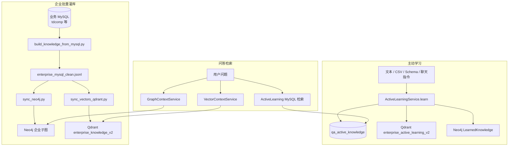

# 知识图谱与向量沉淀指南

本文档说明 SmartQA-Framework 中**知识如何写入 Neo4j（图谱）与 Qdrant（向量）**，以及与之配套的 MySQL 文本存档、运维脚本与问答侧检索关系。内容基于当前代码实现（2026-05）。

---

## 1. 总览：两条沉淀主线

项目中存在**两套相互独立、用途不同**的沉淀机制：

| 维度 | **企业结构化灌库（Bulk Pipeline）** | **主动学习（Active Learning）** |
|------|-------------------------------------|----------------------------------|
| 典型来源 | 业务库 `tdcomp` 等公司/人员/证照表 | 用户粘贴文本、CSV、Schema 目录、对话「记住…」 |
| 编排方式 | Python 脚本离线/运维触发 | Java `ActiveLearningService` 在线 API |
| Neo4j 形态 | `Company`、`Person`、`Certificate` 等企业实体子图 | `LearnedKnowledge` + `LearnedKeyword` 语义子图 |
| Qdrant 集合 | `enterprise_knowledge_v2`（默认） | `enterprise_active_learning_v2`（默认） |
| MySQL 存档 | 不直接写业务表；可选编译为 `enterprise_mysql_compiled.txt` | `assistant.qa_active_knowledge` |
| 问答检索 | `GraphContextService` / `VectorContextService` 主通路 | `ActiveLearningService.retrieveTopChunks`（**MySQL 关键词**，见 §6） |
| 适用场景 | 全量企业主数据、关系穿透、语义相似 | 补充事实、别名、制度摘要、Schema 说明 |



**核心结论：**

- **图谱/向量「主库」**来自业务 MySQL 的 Python 流水线，支撑关系查询与语义检索。
- **主动学习**在运行时把文本同步写入三库，但问答阶段对主动学习的召回**当前走 MySQL LIKE**，写入 Qdrant 的主动学习集合尚未接入主检索链（预留扩展）。
- **待沉淀队列**（`qa_pending_knowledge`）只记录「答不上来」的样本，**不会自动**写入图谱/向量。

---

## 2. 企业结构化灌库（Bulk Pipeline）

### 2.1 流程

```
业务 MySQL (tdcomp)
    ↓  build_knowledge_from_mysql.py（只读 SELECT，按公司聚合）
data/knowledge/enterprise_mysql_clean.jsonl   ← 中间标准格式
    ├→ sync_neo4j.py        → Neo4j 企业图谱
    ├→ sync_vectors_qdrant.py → Qdrant 向量
    └→ enterprise_mysql_compiled.txt（文档兜底检索用）
```

**一键执行：**

```bash
python scripts/enterprise_pipeline/run_pipeline.py \
  --mysql-schema tdcomp \
  --uri bolt://localhost:7687 \
  --wipe \
  --with-vector \
  --embedding-provider dashscope \
  --recreate-vector
```

**应用内 HTTP 等价操作**（Playground / 运维 API）：

| 端点 | 作用 |
|------|------|
| `POST /qa/learn/knowledge-sync/from-mysql` | 清空三库 → 导出 JSONL → 同步 Neo4j + Qdrant |
| `POST /qa/learn/knowledge-sync/rebuild` | 从已有 JSONL 重建 Neo4j + Qdrant |
| `POST /qa/learn/knowledge-sync/reset` | 仅清空三库 |
| `GET /qa/learn/knowledge-sync/status` | 任务状态、JSONL 行数等 |

实现类：`LocalKnowledgeOpsService`（异步调用上述 Python 脚本）。

### 2.2 JSONL 记录结构（摘要）

每行对应一家公司，由 `build_knowledge_from_mysql.py` 从多表 JOIN/聚合生成，主要字段包括：

- `company_id`、`company_name`、注册信息、经营状态、地址、经营范围
- `key_people[]`：法人、监事、财务等角色人员
- `shareholders[]`：股东及持股比例
- `product_lines[]`：产品线/模块
- `certificates[]`：证照类型、状态、编号、有效期
- `seals[]`：印章及保管信息
- `bank_accounts[]`：银行账户摘要

默认**不导出**证照扫描件表 `certificate_attachment`（仅元数据学习）。详见 `scripts/enterprise_pipeline/README.md`。

### 2.3 Neo4j 企业子图写入

脚本：`scripts/enterprise_pipeline/sync_neo4j.py`

**节点标签与唯一键：**

| 标签 | 唯一属性 | 说明 |
|------|----------|------|
| `Company` | `companyId` | 主体公司 |
| `Person` | `personKey` | 关键人员 |
| `Shareholder` | `shareholderKey` | 股东 |
| `ProductLine` | `productKey` | 产品线 |
| `Certificate` | `certKey` | 资质证照 |
| `Seal` | `sealKey` | 印章 |
| `BankAccount` | `accountKey` | 银行账户 |

**关系类型：**

| 关系 | 含义 |
|------|------|
| `(Person)-[:HAS_ROLE_IN {role}]->(Company)` | 任职/角色 |
| `(Shareholder)-[:HOLDS_SHARES_IN {ratio}]->(Company)` | 持股 |
| `(Company)-[:BELONGS_TO_PRODUCT {relation}]->(ProductLine)` | 产品线归属 |
| `(Company)-[:HAS_CERTIFICATE]->(Certificate)` | 持有证照 |
| `(Company)-[:HAS_SEAL]->(Seal)` | 持有印章 |
| `(Company)-[:HAS_BANK_ACCOUNT]->(BankAccount)` | 银行账户 |
| `(Parent:Company)-[:PARENT_OF]->(Child:Company)` | 母子公司 |

`--wipe` 时删除上述标签节点后全量重建；**不会**删除 `LearnedKnowledge` / `LearnedKeyword`（主动学习子图）。

问答侧由 `GraphContextService` 按意图执行 Cypher（公司 hint、人员角色、证照列表等），与上述 schema 对齐。

### 2.4 Qdrant 企业向量写入

脚本：`scripts/enterprise_pipeline/sync_vectors_qdrant.py`

**集合：** 默认 `enterprise_knowledge_v2`（配置项 `qa.assistant.qdrant-collection`）

**文档构建：** 将 JSONL 每行拼成一段结构化中文摘要（公司名、状态、法人、股东、证照、印章、产品线等），再调用嵌入 API。

**Point 结构：**

| 字段 | 说明 |
|------|------|
| `id` | UUID 或稳定哈希 |
| `vector` | 1024 维（百炼 `text-embedding-v4` 默认） |
| `payload.company_id` | 公司 ID |
| `payload.company_name` | 公司名 |
| `payload.status` | 经营状态 |
| `payload.text` | 摘要全文 |

**嵌入提供方（脚本 `--embedding-provider`）：**

- `dashscope`：百炼 `text-embedding-v4`（生产推荐，需 `DASHSCOPE_API_KEY`）
- `hash`：本地伪向量，仅联调
- `minimax`：MiniMax 嵌入 API

**重要：** 灌库与检索必须使用**同一模型与维度**，否则相似度无意义。Java 侧 `TextEmbeddingService` 与脚本应对齐 `qa.assistant.embedding-*` 配置。

问答侧 `VectorContextService` 对用户问题 embed 后在 `enterprise_knowledge_v2` 做 cosine 搜索，返回 top-K `ContextChunk`。

---

## 3. 主动学习（Active Learning）

### 3.1 核心服务

**类：** `com.qa.demo.qa.learning.ActiveLearningService`

**入口方法：**

```java
// 三路全开（MySQL + Qdrant + Neo4j）
learn(rawContent, sourceType, sourceName, triggerType, scope)

// 按沉淀方案选择性写入
learnWithSinkPolicy(rawContent, ..., LearningSinkPolicy policy)
```

**处理步骤：**

1. **规范化正文**：去 BOM、截断至 100,000 字符
2. **抽取标题**：Markdown `#` 首行，否则用 `sourceName`，默认「主动学习知识片段」
3. **抽取关键词**：中英文 token，数量由 `LearningSinkPolicy.keywordLimit` 控制（默认 12，范围 4～24）
4. **并行写入三路**（任一路成功即视为整体成功）

### 3.2 MySQL 写入

**表：** `{mysql-schema}.qa_active_knowledge`（默认 `assistant.qa_active_knowledge`）

| 字段 | 说明 |
|------|------|
| `knowledge_id` | UUID，全局唯一 |
| `title` | 标题（≤255） |
| `content` | 全文 LONGTEXT |
| `source_type` | 来源类型，如 `manual_text`、`csv_structured`、`mysql_schema_catalog` |
| `source_name` | 来源标识，如文件名、`schema-tdcomp` |
| `trigger_type` | 触发方式，如 `chat_intent`、`csv_api` |
| `scope` | `enterprise` / `personal` |
| `created_at` | 创建时间 |

表不存在时自动 `CREATE TABLE`；支持 legacy 无 `scope` 列的降级插入。

### 3.3 Qdrant 写入（主动学习集合）

**集合：** `qa.assistant.qdrant-active-learning-collection`（默认 `enterprise_active_learning_v2`）

**流程：**

1. `PUT /collections/{collection}` 确保集合存在（Cosine，维度 = `vector-embedding-dim`）
2. `TextEmbeddingService.embed(title + "\n" + content)` 生成向量
3. `PUT /collections/{collection}/points?wait=true` upsert

**Payload：**

| 字段 | 说明 |
|------|------|
| `knowledge_id` | 与 MySQL 一致 |
| `title` | 标题 |
| `text` | 正文截断至 4000 字 |
| `source_type` / `source_name` | 来源 |
| `scope` | 作用域 |
| `created_at` | ISO 时间 |

Point `id` 为 `knowledge_id` 的稳定正 long 哈希。

### 3.4 Neo4j 写入（主动学习子图）

**Cypher 逻辑**（`persistToGraph`）：

```cypher
MERGE (d:LearnedKnowledge {knowledgeId: $knowledgeId})
SET d.title = $title,
    d.content = $content,       -- 截断至 6000 字
    d.sourceType = $sourceType,
    d.sourceName = $sourceName,
    d.scope = $scope,
    d.updatedAt = $updatedAt,
    d.createdAt = coalesce(d.createdAt, $updatedAt)

// 关键词子图
UNWIND $keywords AS kw
MERGE (k:LearnedKeyword {name: kw})
MERGE (d)-[:HAS_KEYWORD]->(k)
```

**说明：** 主动学习图谱是**轻量级语义索引**（文档节点 + 关键词），与企业实体图谱（Company/Person 等）**并存、不合并**。当前 `GraphContextService` 主检索**不查询** `LearnedKnowledge` 节点。

### 3.5 写入策略对象

**类：** `LearningSinkPolicy`

```java
record LearningSinkPolicy(boolean mysql, boolean qdrant, boolean neo4j, int keywordLimit)
```

- `allEnabled()`：三路全开
- 关闭的路返回 `SinkStatus.skip`，不计入失败
- 由 Schema 沉淀方案 JSON 解析后传入（见 §4.3）

---

## 4. 沉淀入口与 API

### 4.1 直接文本学习

| API | 说明 |
|-----|------|
| `POST /qa/learn/text` | JSON 正文，`sourceType=manual_text` |
| `POST /qa/learn/upload` | Markdown 文件上传 |

默认 `scope=enterprise`，三路全开写入。

### 4.2 对话内学习

用户问句含「记住 / 学习 / 请记住 …」时，`ChatLearningCommandParser` 解析后走 `ActiveLearningService.learn`：

- `sourceType` = `chat_intent`
- `sourceName` = `chat_message`
- `triggerType` = 触发词（如「记住」）

示例：「请记住老布是李晓峰」→ 写入三库，后续可通过 MySQL 关键词检索参与问答与别名解析。

### 4.3 CSV 结构化接入

| API | 说明 |
|-----|------|
| `POST /qa/structured/csv-ingest` | 单文件，行数 ≤ `max-structured-ingest-rows`（默认 10000） |
| `POST /qa/structured/csv-batch-learn` | 批量分析 + 学习 |
| `POST /qa/structured/csv-batch-learn-auto` | 一键批量（MySQL 先行，按需向量/图谱） |

CSV **不直接改业务表**，包装为 Markdown/文本后调用 `ActiveLearningService`。超行数拒绝写入。

### 4.4 MySQL Schema 目录学习

| API | 说明 |
|-----|------|
| `POST /qa/mysql/schema-catalog` | 只读 `information_schema` → Markdown；可选 `assess`（模型评估）、`persist`（写入主动学习） |
| `POST /qa/mysql/sedimentation/pipeline` | 模型输出 **JSON 沉淀方案** → 可选 digest → **按路开关**写入 |

**Schema 目录流水线要点：**

- 仅使用配置的 `qa.assistant.mysql-*`，不接受任意 JDBC
- 不批量拉业务行，只写元数据 Markdown
- 表数上限：`max-schema-export-tables`（默认 15）
- 文档长度上限：`max-schema-export-chars`（默认 250000）

**沉淀方案流水线 JSON 字段（摘要）：**

| 字段 | 说明 |
|------|------|
| `feasible` | 是否建议沉淀 |
| `sinks.mysql/qdrant/neo4j.enabled` | 各路开关 |
| `sinks.neo4j.keywordLimit` | 关键词数量 |
| `ingest.bodyStrategy` | `model_digest`（二次模型精炼）或 `catalog_as_is`（原目录） |

设计细节见 `openspec/design/schema-sedimentation-plan-pipeline.md`。

### 4.5 多专家协作学习

| API | 说明 |
|-----|------|
| `POST /qa/learning/multi-expert` | 连接业务库，模拟三专家（数据分析 / 架构 / 策略）分析表结构后执行学习 |

最终仍调用 `ActiveLearningService`（可带 `LearningSinkPolicy`），并更新 `sync_tracking` 增量同步状态。

### 4.6 待沉淀队列（非自动灌库）

当问答 **未知意图** 或 **证据不足**（`canAnswer=false`）时：

1. `QaAskFlowService` 调用 `SedimentationQueueService.enqueuePending`
2. 写入 `qa_pending_knowledge`（问题、意图、证据 JSON）
3. 并行追加 `data/qa_logs/` 下 jsonl 候选事件

| API | 说明 |
|-----|------|
| `GET /qa/sedimentation/pending` | 查看待处理队列 |
| `POST /qa/feedback` | 用户反馈（另表 `qa_user_feedback`） |

**注意：** 队列中的记录需要人工或后续流程审核后，再通过 `/qa/learn/text` 等接口**显式**写入三库；系统不会自动把 pending 项 embed 进 Qdrant。

---

## 5. 向量化（Embedding）

**统一服务：** `TextEmbeddingService`

| 配置项 | 默认值 | 说明 |
|--------|--------|------|
| `qa.assistant.embedding-provider` | `dashscope` | 无 API Key 时降级 `hash` |
| `qa.assistant.embedding-model` | `text-embedding-v4` | 百炼模型 |
| `qa.assistant.vector-embedding-dim` | `1024` | 向量维度 |
| `qa.assistant.dashscope-api-key` | 环境变量 | `DASHSCOPE_API_KEY` |

**使用位置：**

- 主动学习写入 Qdrant：`embed(title + "\n" + content)`
- 企业向量检索：`embed(question)`
- Python 灌库脚本：独立实现，须与 Java 配置一致

---

## 6. 沉淀与检索的关系

### 6.1 企业主数据检索

| 组件 | 存储 | 检索方式 |
|------|------|----------|
| `VectorContextService` | Qdrant `enterprise_knowledge_v2` | 问题向量 cosine top-K |
| `GraphContextService` | Neo4j 企业子图 | 意图驱动 Cypher（公司/人员/证照等） |
| `DocumentContextService` | `enterprise_mysql_compiled.txt` | 关键词/片段 |

由 `QaRetrievalPipeline` 按意图或统一多路召回编排，可选百炼 rerank。

### 6.2 主动学习检索

| 组件 | 存储 | 检索方式 |
|------|------|----------|
| `ActiveLearningService.retrieveTopChunks` | MySQL `qa_active_knowledge` | 问句分词 + title/content `LIKE` + 打分 |
| Qdrant 主动学习集合 | 已写入 | **当前未接入**主问答检索链 |
| Neo4j LearnedKnowledge | 已写入 | **当前未接入** `GraphContextService` |

主动学习命中后：

- 短问/记忆类问句可**优先**走主动学习证据（`QaAskFlowService`）
- 企业检索结果可通过 `mergeEnterpriseActiveLearning` **合并**高置信主动学习片段（如别名事实）
- `augmentQuestionForStructuredRetrieval` / `resolvePersonAlias` 用主动学习中的「别名→实名」改写结构化检索问句

### 6.3 企业常识（非沉淀通道）

`enterprise-canonical-facts.json` 中的稳定事实在启动时加载，**不走**灌库流水线，但与主动学习一样可在检索前注入。见 `docs/enterprise-canonical-facts.md`。

---

## 7. 运维与重置

### 7.1 清空本地三库

```bash
python scripts/ops/reset_local_stores.py
# 可选 --clear-logs 清空 qa 日志
```

删除：

- Qdrant：`enterprise_knowledge_v1/v2`、`enterprise_active_learning_v1/v2`
- Neo4j：企业实体节点 + `LearnedKnowledge` / `LearnedKeyword`
- MySQL assistant：相关系统表数据（见脚本实现）

### 7.2 从 JSONL 重建

```bash
python scripts/ops/rebuild_local_knowledge.py [--limit N] [--clear-logs]
```

### 7.3 配置速查

```properties
# 企业向量
qa.assistant.qdrant-collection=enterprise_knowledge_v2
qa.assistant.qdrant-url=http://localhost:6333

# 主动学习向量
qa.assistant.qdrant-active-learning-collection=enterprise_active_learning_v2

# 主动学习 MySQL
qa.assistant.mysql-url=jdbc:mysql://localhost:3306/assistant
qa.assistant.mysql-schema=assistant

# 业务库（灌库数据源）
qa.assistant.business-mysql-url=jdbc:mysql://localhost:3306/tdcomp

# Neo4j
graph.neo4j.uri=bolt://localhost:7687
```

---

## 8. 源码索引

| 模块 | 路径 |
|------|------|
| 主动学习核心 | `src/main/java/com/qa/demo/qa/learning/ActiveLearningService.java` |
| 写入策略 | `src/main/java/com/qa/demo/qa/learning/LearningSinkPolicy.java` |
| Schema 沉淀方案 | `src/main/java/com/qa/demo/qa/learning/SchemaSedimentationPlanService.java` |
| CSV 接入 | `src/main/java/com/qa/demo/qa/learning/StructuredCsvIngestService.java` |
| 聊天学习指令 | `src/main/java/com/qa/demo/qa/learning/ChatLearningCommandParser.java` |
| 运维灌库 | `src/main/java/com/qa/demo/qa/ops/LocalKnowledgeOpsService.java` |
| 待沉淀队列 | `src/main/java/com/qa/demo/qa/sedimentation/SedimentationQueueService.java` |
| 向量嵌入 | `src/main/java/com/qa/demo/qa/embedding/TextEmbeddingService.java` |
| 企业向量检索 | `src/main/java/com/qa/demo/qa/retrieval/VectorContextService.java` |
| 企业图谱检索 | `src/main/java/com/qa/demo/qa/retrieval/GraphContextService.java` |
| MySQL 导出 | `scripts/enterprise_pipeline/build_knowledge_from_mysql.py` |
| Neo4j 同步 | `scripts/enterprise_pipeline/sync_neo4j.py` |
| Qdrant 同步 | `scripts/enterprise_pipeline/sync_vectors_qdrant.py` |
| HTTP 入口 | `src/main/java/com/qa/demo/qa/web/QaController.java` |

---

## 9. 设计边界与已知限制

1. **主动学习 Qdrant/Neo4j 写入 ≠ 问答召回**：当前召回依赖 MySQL 关键词；向量/图谱侧的主动学习数据为预留能力。
2. **Schema / CSV 学习不写业务行**：只沉淀文本知识，结构化问答仍依赖业务库 live 查询或企业灌库。
3. **无自动去重**：同一 Schema 多次 `persist=true` 会产生多条 `qa_active_knowledge` 记录。
4. **嵌入模型变更需重建集合**：维度或模型变化时必须 `--recreate` Qdrant 集合并全量 re-embed。
5. **待沉淀队列不闭环**：pending 项需人工审核后再调用学习 API。
6. **Bulk 与企业子图 wipe 范围**：`sync_neo4j.py --wipe` 不清理 `LearnedKnowledge`；全量 reset 脚本会一并清理。

---

## 10. 相关文档

- [**企业知识同步平台方案（EKSP）**](./enterprise-knowledge-sync-platform.md) — 增量同步、Domain Pack 域扩展（合同/客户/商机等），解决灌库无法随数据更新、域无法扩展的问题
- [系统架构总览](./architecture.md)
- [Enterprise Pipeline 脚本说明](../scripts/enterprise_pipeline/README.md)
- [MySQL Schema 主动学习设计](../openspec/design/mysql-schema-active-learning-pipeline.md)
- [Schema 沉淀方案流水线](../openspec/design/schema-sedimentation-plan-pipeline.md)
- [结构化接入门禁](../openspec/design/structured-ingest-gate.md)
- [企业常识事实](./enterprise-canonical-facts.md)
- [本地验证与灌库计划](./local-validation-plan.md)
