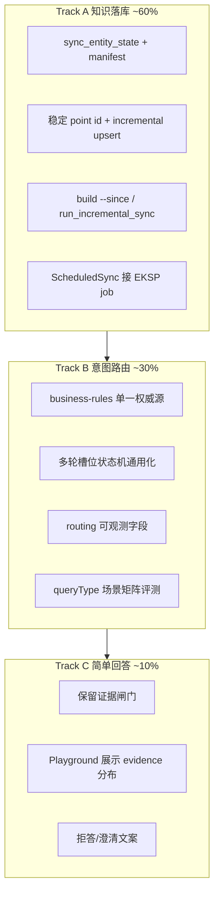

# 本地验证 MVP 调整线路

> 版本：2026-05-28  
> 状态：执行中  
> OpenSpec：[`openspec/changes/2026-local-validation-mvp/`](../openspec/changes/2026-local-validation-mvp/proposal.md)  
> 关联：[EKSP 方案](./enterprise-knowledge-sync-platform.md)、[建设 Gap 盘点](./enterprise-knowledge-building-gaps.md)、[`openspec/backlog.md`](../openspec/backlog.md)

## 1. 阶段定位

**目标**：在本地环境验证「知识能增量进库 → 问句能稳定路由 → 有证据能答、无证据拒答」，暂不实现权限隔离、CDC、文档精细分块、回答强化。

**成功标准（与具体业务案例解耦）**：

| # | 标准 | 验收方式 |
|---|------|----------|
| K1 | 结构化主数据可增量 upsert 到 Neo4j + Qdrant（无日常 wipe） | 改一条 company → 约定时间内三库一致 |
| K2 | 问句（含多轮）稳定映射到正确 `queryType` 与槽位 | 场景矩阵 + Playground `routing` 字段可核对 |
| K3 | 简单回答：有证据生成、无证据拒答 | `QaAnswerGateService` 放行/拦截可观测 |
| — | **本版不做** | 行级权限、CDC、BM25/GraphRAG、列表模板化、红黄线 |

---

## 2. 三轨并行结构



Track A 与 Track B 可并行；Track C 仅维护现有闸门，不扩展生成能力。

---

## 3. Sprint 划分

### Sprint 1（当前，~1 周）— 基础设施

| 任务 | 状态 | 说明 |
|------|------|------|
| `sync_entity_state` Flyway 迁移 | 进行中 | `V3__sync_entity_state.sql` |
| `sync_manifest.yaml` 骨架 | 进行中 | 先含 `org_master` |
| Qdrant 稳定 point id | 进行中 | `domain+entity_type+entity_id` → UUID |
| `build_knowledge_from_mysql.py --since` | 进行中 | 按 `updated_at` 水位增量拉取 |
| `run_incremental_sync.py` 编排脚本 | 进行中 | build → neo4j upsert → qdrant upsert |
| 多轮实体继承泛化 | 进行中 | 不绑定证照场景 |
| 响应 `routing` 可观测字段 | 进行中 | queryType / routeSource / followUp |

### Sprint 2（~1～2 周）— 增量闭环

| 任务 | 状态 | 说明 |
|------|------|------|
| 启用 Flyway | 已完成 | `qa.assistant.flyway-enabled=true`；V1～V4 迁移 |
| `SyncEntityStateService` | 已完成 | 读写 `sync_entity_state` |
| 重写 `ScheduledSyncService` | 已完成 | 触发 EKSP incremental（需 `knowledge-sync-incremental-scheduled-enabled=true`） |
| `POST /qa/learn/knowledge-sync/incremental` | 已完成 | 手动增量同步 |
| content_hash 变更检测 | 已完成 | 同步后跳过 hash 未变实体 |
| tombstone / 软删传播 | 待办 | Sprint 3 |

**验收 K1**：修改 company → 跑 incremental → 问答结果更新。

### Sprint 3（~1～2 周）— 意图稳定化

| 任务 | 说明 |
|------|------|
| `business-rules.json` 收敛 | lexicon 路由词逐步合并，单一权威源 |
| 多轮 LLM + 规则 fallback 统一 | `enrichIntentForFollowUp` 槽位继承矩阵 |
| `data/eval/routing_cases.jsonl` | 单轮/多轮/缺槽/切换 queryType 用例 |
| 题型相关闸门（通用） | 按 queryType 校验 evidence source 类型，非单点证照 |

**验收 K2**：场景矩阵通过率 ≥ 目标阈值（本地自定，建议 90%）。

### Sprint 4（~1 周）— 联调与文档

| 任务 | 说明 |
|------|------|
| Playground 展示 routing + evidence 计数 | 排障友好 |
| 更新 pipeline README | incremental 运维说明 |
| spec.md 回写稳定行为 | OpenSpec 归档 |

---

## 4. 意图路由：通用原则（非业务案例绑定）

### 4.1 路由输出契约

每轮问答 MUST 产出：

- `queryType`：驱动检索计划（见 `business-rules.json` → `RetrievalPlanFactory`）
- 槽位：`personName` / `companyHints` / `roleFocus` 等（按 queryType 要求）
- `routing.routeSource`：`rule` | `llm` | `followup_llm` | `session_inherit` | `llm_timeout`

### 4.2 多轮规则（领域无关）

| 场景 | 行为 |
|------|------|
| 延续性短句（「这些呢」「还有呢」） | 继承上一轮槽位；`queryType` 由 LLM/规则按**当前语义**决定，可切换 |
| 指代性追问（「这些主体」「上面那些」） | 合并上一轮 `retrievedEntities` 到对应槽位 |
| 缺槽 | 澄清或拒答，不 hallucinate 默认 queryType |
| 独立新问题 | 不继承槽位，重新路由 |

### 4.3 验证矩阵（示例，可扩展）

```
routing_cases.jsonl 每条记录：
  { "turns": [...], "expectQueryType": "...", "expectSlots": {...}, "tags": ["single-turn"|"multi-turn"|"slot-inherit"|"intent-switch"] }
```

具体 queryType 名称以 `business-rules.json` 为准，**不以单一实测案例定义产品边界**。

---

## 5. 知识落库：本版范围

### 5.1 在 scope 内

- 域：`org_master`（company / employee / certificate / seal …）
- 同步：水位 + content_hash（Sprint 2）；Sprint 1 先 `--since`
- 存储：Neo4j MERGE upsert；Qdrant 稳定 id upsert
- Payload 预留：`domain`、`entity_type`、`entity_id`（权限字段占位，本版不使用）

### 5.2 在 scope 外（明确推迟）

- Debezium CDC（P2，大表再上）
- 行级 ACL Filter
- PDF/Word 章节分块流水线
- customer / contract Domain Pack（Sprint 4 之后）

---

## 6. 简单回答：本版边界

**保留**：

- `QaAnswerGateService`：无足够 evidence → 不调 LLM
- evidence 列表完整返回
- 基础 confidence

**不做**：

- 列表条数与 SQL 严格对齐
- 模板化/表格输出
- 红黄线合规引擎

---

## 7. 文档与代码索引

| 主题 | 路径 |
|------|------|
| 本线路 | `docs/local-validation-mvp-roadmap.md` |
| OpenSpec 变更 | `openspec/changes/2026-local-validation-mvp/` |
| 同步 manifest | `scripts/enterprise_pipeline/sync_manifest.yaml` |
| 增量编排 | `scripts/enterprise_pipeline/run_incremental_sync.py` |
| 公共 sync 工具 | `scripts/enterprise_pipeline/sync_common.py` |
| 路由规则 | `src/main/resources/qa/business-rules.json` |
| 问答主流程 | `QaAskFlowService` |
| 多轮会话 | `QaConversationService` |

---

## 8. 变更记录

| 日期 | 说明 |
|------|------|
| 2026-05-28 | 初版：本地验证 MVP 三轨线路；知识落库 + 意图优先，简单回答，权限/CDC 推迟 |
