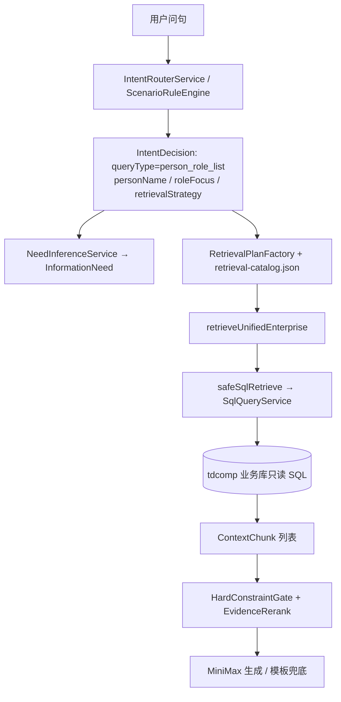

# 问答四个疑问分析（基于 6.18 晚间实测 + 代码）

> 版本：2026-06-22  
> 依据：`data/qa_logs/gate_metrics.jsonl`、`ask_events.jsonl`、`knowledge_candidates.jsonl`（6.18 19:00 批次）及当前主分支 Java/配置。  
> 说明：分析时本机 MySQL 未启动，未查询 `qa_ask_trace`；日志与代码结论一致。

---

## 疑问一览

| # | 问题 | 结论摘要 |
|---|------|----------|
| 1 | `person_role_list` 怎么实现？ | 意图路由 → `retrieval-catalog` 专用列表通路 → **仅走业务库 LLM 生成 SQL**（非图谱主通路）；评测集走通依赖 `queryType=person_role_list`。 |
| 2 | 为何大量回答基于约 30 条样本？能否全面放开？ | **多处硬上限叠加**（向量 30、rerank 50、默认 trim 20）；聚合/全量统计未走 SQL `COUNT/GROUP BY` 时会误用 unified 样本。可放开，需分通路改配置与代码。 |
| 3 | 为何召不回法人字段？`legal_rep_id` 已在 tdcomp | 6.18 晚间「戴科彬法人」**未走** `person_role_list`，而是 `semantic` + 向量证据；Qdrant 编译文本片段常**不展示**法定代表人，与库表字段存在是两件事。 |
| 4 | 6.18 上传文档学习后问答差，是否重构未调好？ | **部分是**：`/documents/upload` 写入 `qa_document_chunk` 但主检索**未接入** `user_uploads`；向量灌库默认关闭；`/learn/text` 走主动学习通道，与上传文档不是同一路。 |

---

## 1. `person_role_list` 实现机制

### 1.1 端到端链路



### 1.2 意图如何变成 `person_role_list`

| 环节 | 位置 | 行为 |
|------|------|------|
| 规则关键词 | `business-rules.json` → `intentRules.queryTypeConditions` | 含「法人」「法定代表人」「任职」等；`requiresPerson: true` |
| LLM 意图 | `IntentRouterService` + `KnowledgeAssistantPrompts` | 可输出 `queryType` / `retrievalStrategy` / `roleFocus`（如 `legal_rep`） |
| 策略推导 | `IntentSlots.deriveChannels` | `STRUCTURED_LIST` / `GRAPH_RELATIONAL` + 有人名 + 有角色焦点 → `person_role_list` |
| 规则优先 | `intent-rule-first-for-structured=true` | 结构化问句先规则，再 LLM assist |

`roleFocus` 与「法人」映射见 `enterprise-lexicon.json`：`legal_rep` ← 「法定代表人」「法人」。

### 1.3 检索计划（catalog 驱动）

`retrieval-catalog.json` 中 `person_role_list`：

- `facet=role`，`granularity=list`，`listExpected=true`
- `execution.path=dedicated_list`，`routeLabel=unified_person_role`
- `skipTruncation=true`，`skipEmployeeBaseAppend=true`，`expandRecallTopK=true`

`RetrievalPlanFactory` 在 `expandRecallTopK` 时：

- `finalEvidenceTopK = max(retrieval-top-k, recallGraphPersonRoleTopK)` → 默认 **max(50, 32) = 50**
- SQL `LIMIT` 由 `SqlTopKResolver` 对 dedicated list 至少取 `finalEvidenceTopK`

### 1.4 专用列表通路的核心代码行为

`QaRetrievalPipeline.collectHybridCandidatesExpanded`：

- 当 `execution.dedicatedListPath()` 为 true（即 `person_role_list`）时，**只调用** `safeSqlRetrieve`，**不**走向量 / MySQL 关键词扫表 / 编译文档。
- 返回前经 `trimEvidence(..., routeLabel)`，标签为 `unified_person_role`。

`SqlQueryService`：

- 连接 `qa.assistant.business-mysql-url`（**tdcomp**）
- 将 `semantic-schema.json` 摘要 + 问句（含 `[实体提示] 人员=`、`[角色焦点]`、`[查询形态] person_role_list`）发给 MiniMax **生成只读 SQL**
- `semantic-schema.json` 已声明 `company.legal_rep_id` → `employee.name`（法定代表人）

### 1.5 人物澄清（与列表检索并列）

`PersonClarificationAdvisor`：仅当 **已是** `person_role_list` 且人员无法锁定（如花名、证据 `employee_not_found`）时，在检索前返回 `ask_person_clarification`。

### 1.6 与 6.18 晚间的差异（重要）

评测用例「戴科彬在哪些企业担任法定代表人」在跑批时：

- `queryType=person_role_list`，`route=unified_person_role`，evidence≈27

6.18 19:20 同主题问句「法人是戴科彬的主体有哪些」：

- `queryType=semantic`，`route=unified_constrained_rerank_dashscope_generate_llm`，evidence=30
- **未进入** `person_role_list` 专用 SQL 通路

另一次（19:22）因路由为 `person_role_list` 但触发 `needs_person_clarification`，`retrievalSource=none`。

**结论**：`person_role_list` 实现完整度取决于**意图是否稳定命中**；实现本身以 **LLM+SQL** 为主，并非「直接读 `legal_rep_id` 列」的固定查询模板。

---

## 2. 「30 条样本」限制从哪来？如何放开？

### 2.1 6.18 晚间现象

会话二（统计 / 分类 / 戴科彬法人）多次 `evidenceCount=30` 或 `31`，回答明确写「本轮证据中的 30 条公司记录」——与日志中 `source=qdrant-vector+rerank` 一致，走的是 **unified 混合召回 + 重排**，不是全库 SQL 聚合。

### 2.2 限制来源（多层叠加）

| 层级 | 配置/代码 | 实际效果 |
|------|-----------|----------|
| 向量召回硬上限 | `VectorContextService`：`Math.min(topK, **30**)` | `recall-vector-top-k=80` **无效**，最多 30 点 |
| 图谱召回默认 | `recall-graph-top-k=30` | 图谱候选池约 30（unified 主路径中非 list 专用时） |
| 送入 LLM 证据 | `retrieval-top-k=50` + rerank `finalTopK` | 候选池若主要来自向量，上限仍约 30 |
| 配置 trim | `business-rules.json` → `trim.byQueryType.person_role_list: 30` | 列表类配置意图 30（list 专用通路 `skipTruncation` 可跳过部分截断） |
| 默认 trim | `trim.default: 20` | 部分 source 再裁到 20 |
| MySQL 关键词路 | `mysql-top-k=6`，`mysql-per-table-limit=3` | 关键词扫表路本身很小（非晚间主因） |
| 用户上传文档 | `retrieveUserUploadTopChunks`：`min(topK, **10**)` | 上传 chunk 最多 10 条（且见 §4，当前几乎未接入主流程） |
| 编译文档 DB | `scoreChunkRows`：`min(topK, 10)` | `qa_document_chunk` 关键词匹配最多 10 条 |

### 2.3 为何「全量统计」仍只有 30 条？

`retrieveUnifiedEnterprise` 中 **COUNT 专用早退**：

```text
strategy == AGGREGATE_COUNT
或 need.isAggregate() 且 非 FilterFieldQuestionSupport.isFilterThresholdNeed(need)
→ aggregateCountQueryService.retrieve(question)  // 全库 COUNT，evidence=1
```

6.18 19:14「现在有多少公司」正确得到 **386**（`llm_aggregate_count`，evidence=1）。

但「都在有效期内吗」「给我分类显示数量」「统计所有公司」：

- `queryType=aggregate` 或语义相近，但走 **unified + 30 条向量样本** 让 LLM **人工分类计数**
- 用户要求「所有公司」时，系统未再次触发 `GROUP BY operating_status` 类 SQL

**这是通路选择问题，不是单纯把 30 改成 500 就能解决。**

### 2.4 放开建议（按优先级）

| 优先级 | 动作 | 目的 |
|--------|------|------|
| P0 | 去掉或提高 `VectorContextService` 的 **30 硬顶**（与 `recall-vector-top-k` 对齐） | unified 候选池立刻变大 |
| P0 | 聚合/分布类：Need 推断 + `AGGREGATE_COUNT` / `GROUP BY` SQL 模板，禁止用 30 条样本代替全库统计 | 解决会话二分类计数 |
| P1 | 提高 `retrieval-top-k` / `rerank-candidate-max`；list 类保持 `skipTruncation` | 列表题证据条数对齐 SQL |
| P1 | 评测门禁：对「全量/所有」问句断言 `retrievalSource` 含 `aggregate` 或 `sql`，且 evidence 条数 ≠ 30 | 防止回归 |
| P2 | 环境变量级「验证模式」：`qa.assistant.eval-unlimited-recall=true` 统一抬高各 topK | 本地全面放开、生产可关 |

---

## 3. 为何召不回法人字段（`legal_rep_id`）

### 3.1 字段在配置里是有的

`semantic-schema.json`：

```json
{ "column": "legal_rep_id", "label": "法定代表人",
  "targetEntity": "employee", "targetDisplayColumn": "name", "type": "employee_id" }
```

CDC / 灌库侧 `CdcPersonRoleBindingExtractor` 也会从 `company` 行解析 `legal_rep_id` 写入图谱关系。

### 3.2 6.18 晚间实际走的不是「法人 SQL 通路」

| 时间 | 问句 | queryType | 检索源 | 现象 |
|------|------|-----------|--------|------|
| 19:20 | 法人是戴科彬的主体有哪些 | `semantic` | `qdrant-vector+rerank` | 30 条公司向量片段，多数 snippet **无法定代表人行** |
| 19:21 | legal_rep_id 是法定代表人，重新生成 | `semantic` | 无（evidence=0） | 用户纠错未触发重新 SQL |
| 19:22 | 法人是戴科彬的主体有哪些（新会话） | `person_role_list`（澄清） | `none` | 人员澄清，未检索 |

向量证据片段来自 `enterprise_mysql_compiled` / Qdrant payload 文本：很多公司块里 `法定代表人:` 为空（灌库或展示截断），LLM 只能诚实说「片段里没看到戴科彬」。

### 3.3 根因归纳

1. **路由**：「法人是 X 的主体」未稳定解析为 `person_role_list` + `roleFocus=legal_rep` + `personName=戴科彬`（与「戴科彬在哪些企业担任法定代表人」句式不同）。
2. **通路**：误走 unified 时不会执行「按 `legal_rep_id` JOIN employee」的 SQL 意图。
3. **证据形态**：向量/编译文本 ≠ 表字段投影；**列在库里存在 ≠ 出现在 evidence snippet**。
4. **纠错**：「legal_rep_id 是法定代表人」被当作新问句，未绑定上一轮实体与 SQL 重跑。

### 3.4 改进方向

- 规则：「法人/法定代表人」+ 人名 → 强制 `person_role_list` + `legal_rep`（弱化 LLM 覆盖）
- SQL：对 `person_role_list` 增加 **规则 SQL 兜底**（按 `employee.name` + `legal_rep_id` 查 `company`），LLM 失败时仍可用
- 灌库：编译文本 / Qdrant payload **始终带上法定代表人姓名**，与 `legal_rep_id` 解析一致
- 多轮：用户字段纠错 → 继承上一轮 queryType/人名，**强制重检索**而非仅 `insufficient_evidence`

---

## 4. 6.18 文档上传学习后问答效果差

### 4.1 系统里有两条「学习」路径（易混淆）

| 入口 | 写入位置 | 问答如何召回 |
|------|----------|--------------|
| `POST /qa/learn/text` | `qa_active_knowledge` +（可选）Neo4j LearnedKnowledge + Qdrant **active_learning** 集合 | `safeActiveLearningRetrieve` → `mergeLearnedUnconditionally` 并入 unified |
| `POST /qa/documents/upload` | `qa_document_chunk`（corpus 默认 `user_uploads`）+ 可选 Qdrant 主集合 | 见下表 |

### 4.2 上传文档通路当前缺口（重构后未闭环）

| 能力 | 状态 |
|------|------|
| 切块写入 `qa_document_chunk` | ✅ `DocumentIngestService` |
| 写入 Qdrant 主集合 | ❌ 默认 `document-vector-ingest-enabled=false` |
| 主问答检索 `user_uploads` | ❌ `safeUserDocumentRetrieve()` **已定义但未被任何调用方使用**（死代码） |
| `document-from-db=true` | 只加载 `document-corpus-code=enterprise_mysql_compiled`，**不是** `user_uploads` |
| 关键词检索上传 chunk | 最多 **10** 条，且未接入 unified |

因此：若 6.18 使用的是 **文档上传 API**，内容很可能 **从未进入问答主检索**。

### 4.3 6.18 晚间与「学习/制度」相关的问答

| 问句 | 实际证据来源 | 与上传文档关系 |
|------|--------------|----------------|
| 我刚入职，我要出差，该咋办 | unified 向量/compiled 混合 | 未命中出差制度；回答「证据中无制度」——合理 |
| 看看你主动学习的文档呢 | 命中「企业信息化亿点通」等 **compiled/主动学习** 片段 | 不是用户上传的 `user_uploads` |

晚间日志中 **未发现** 明显的 `upload:` / `documents/upload` 管理记录；若上传发生在其他时段或通过 Playground 另一接口，需补查 `admin_actions.jsonl` 或 MySQL `qa_document_chunk`。

### 4.4 是否「重构后没调好」？

**是的，主要体现在：**

1. P5 文档上传与 unified 检索 **接线未完成**（`user_uploads` 未合并进 `collectHybridCandidatesExpanded`）。
2. 向量灌库开关默认关闭，语义召回不到上传内容。
3. 主动学习（`/learn/text`）与上传文档 **产品预期不同**：前者进关键词/Qdrant 副集合；后者进 chunk 表但当前 **不参与** 主召回。
4. 制度/流程类问句仍常被路由为 `company_profile` + unified，未单独 `policy` 文档通路。

### 4.5 建议修复顺序

1. 在 `retrieveUnifiedEnterprise` 中调用 `safeUserDocumentRetrieve`（或合并进 `collectHybridCandidatesExpanded`）。
2. 本地验证打开 `document-vector-ingest-enabled=true`，使上传内容进入 Qdrant。
3. 制度/流程问句路由到 `policy` + 文档/主动学习优先。
4. 上传后返回明确提示：「已写入 chunk N 条 / 向量 M 条；问答 scope/corpus 为 user_uploads」。

---

## 5. 与本地验证 MVP 计划的对应关系

| MVP 轨道 | 本文问题 |
|----------|----------|
| Track B 意图 Sprint 3 | §1 路由不稳定、§3 法人未走 list 通路 |
| Track C + 评测 | §2 30 条样本无法支撑全量验收 |
| Track A 灌库 | §3 向量片段缺法人字段 |
| P5 文档上传 | §4 上传未接入检索 |

建议将 §2、§3、§4 的 P0 项纳入下一轮迭代任务，并用 `routing_cases.jsonl` + 聚合全量 case 做回归。

---

## 6. 参考代码与配置索引

| 主题 | 路径 |
|------|------|
| 统一检索主流程 | `QaRetrievalPipeline.retrieveUnifiedEnterprise` |
| person_role 专用 list | `collectHybridCandidatesExpanded` + `retrieval-catalog.json` |
| SQL 生成 | `SqlQueryService` + `semantic-schema.json` |
| 向量 30 上限 | `VectorContextService.retrieveTopChunks` |
| TopK 计划 | `RetrievalPlanFactory`、`application.properties` |
| trim 配置 | `business-rules.json` → `retrievalThresholds.trim` |
| 文档上传 | `DocumentIngestService`、`DocumentVectorIngestService` |
| 主动学习召回 | `ActiveLearningService.retrieveTopChunks`、`mergeLearnedUnconditionally` |
| 6.18 晚间日志 | `data/qa_logs/gate_metrics.jsonl`（19:08–19:36） |

---

## 7. 文档维护

- 若 MySQL 恢复，可补充：`SELECT * FROM qa_ask_trace WHERE created_at BETWEEN '2026-06-18 18:00' AND '2026-06-19 00:00'` 与 jsonl 交叉验证。
- 配置 publish / 重启后行为变化，应在本文「版本」行注明日期与 commit。
